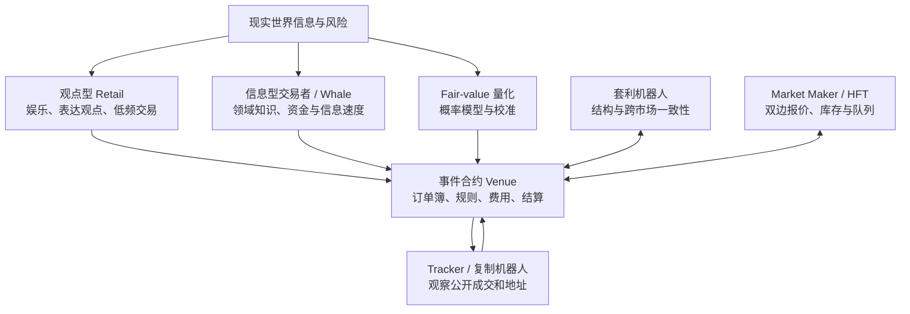
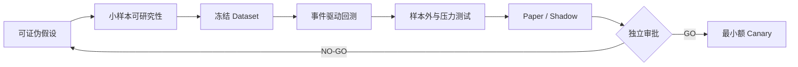
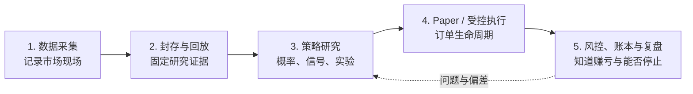

# 事件合约系统化交易白皮书

**v0.2｜市场效率、策略研究与工程落地**<br>
更新日期：2026-08-21｜状态：研究与决策基线｜不构成投资、法律或账户资格建议

> 本项目不复刻某个交易脚本或收益曲线，而是寻找可解释、可证伪、可执行、可停止的事件合约策略。

## 执行摘要

事件合约市场在现金流层面接近零和，扣除费用后对全体交易者是负和；但它仍能承担风险转移、
价格发现和信息聚合功能。对单个参与者而言，区别“量化研究”和“系统化赌博”的关键，不是有没有
程序，而是能否回答四个问题：利润为什么存在、对手为什么愿意付出这个利润、什么证据会证明
策略错误、真实成交成本后是否仍有正期望。

2026 年的头部事件市场已经明显专业化。Pew Research Center 按其 notional taker volume
口径统计，Kalshi 与 Polymarket 在 2026 年 4 月的月成交额合计约 **240 亿美元**；DeFi Rate
按其自身口径给出的 2026 年 7 月数据分别为 Polymarket **85.6 亿美元**、Kalshi **411.2 亿美元**。
这些序列不能不加说明地拼接，但共同说明市场已不是小众实验。[Pew](https://www.pewresearch.org/short-reads/2026/05/27/trading-volume-on-prediction-markets-has-soared-in-recent-months/)、
[Polymarket volume](https://defirate.com/prediction-markets/volume/polymarket/)、
[Kalshi volume](https://defirate.com/prediction-markets/volume/kalshi/)

专业机构也已进入：Wintermute 宣布提供事件合约双边流动性；Susquehanna 在 Kalshi 建立
专门做市能力；Cantor 开始为机构客户安排事件合约大宗交易。
[Wintermute](https://www.wintermute.com/insights/news/announcements/wintermute-enters-prediction-markets-as-a-liquidity-provider-as-event-contract-trading-surpasses-60-billion-in-2026)、
[Susquehanna/Kalshi](https://news.kalshi.com/p/liquid-prediction-markets-are-finally-here/)、
[Cantor](https://www.cantor.com/cantor-commences-institutional-block-trading-in-prediction-markets/)

因此，本项目不再问“有哪些显然的策略”，而改问：

> 哪个市场、哪个时间尺度、哪类参与者行为目前还不够有效率？

首期策略研究集中在三个互补方向：

1. **Fair Probability**：建立合理概率基线，回答“报价是否便宜”；
2. **Spot → Event Lead-lag**：测量参考现货变化后，事件盘口是否存在可成交的反应滞后；
3. **结构约束扫描**：检查 YES/NO、互斥结果和嵌套事件是否违反可执行价格约束。

原 SignalX Demo 中唯一能够从行为证据确认的策略是 `winner_tail_sweep`：在结果接近确定或
已能从参考源判断时，以接近 1 的价格买入获胜方向。它值得离线复盘，但其单次错误可能抵消
大量正常利润，不应成为最早实盘策略。`pm-hft` 更像通用高频引擎，`trade-twap` 是执行算法，
`record-v2` 和 aggregation 属于数据能力，均不能直接当成独立 alpha。

项目成功标准不是短期盈利，而是：

```text
策略假设可证伪
→ 数据身份可追溯
→ 回测不偷看未来
→ 成交假设可解释
→ Paper 与实时偏差可归因
→ 风险和系统都能停止
```

---

## 0. 阅读方式与证据边界

### 0.1 这份白皮书回答什么

本文面向项目负责人、研究人员和未来开发者，回答五个决策问题：

1. 事件合约与赌博、传统衍生品有什么异同；
2. 市场里有哪些参与者，竞争已经激烈到什么程度；
3. 候选策略如何分类，优先研究什么；
4. 如何用数据证伪或支持策略，而不是事后解释收益曲线；
5. 项目需要哪些最小软件能力、资金和人工决策。

正文刻意简化工程细节。WAL、Parquet、Manifest、ClickHouse、OMS 等只是为研究可信度和
实盘安全服务的工具，不是项目目的。

### 0.2 证据等级

本文使用三种标签：

- **已确认**：来自官方文档、公开接口实采、授权控制台或可复核日志；
- **推断**：多条已确认事实支持，但仍可能有其他解释；
- **假设**：准备通过数据验证的策略或市场判断。

特别说明：arXiv:2605.11640 的早期版本曾给出特定高频/whale cohort 占比与成交贡献数字，
但 v2 已修正样本范围，并明确警告精确 cohort share 不能当作稳定的平台属性。因此 v0.2
不使用“12.6% 地址贡献 81.4% notional”作为市场事实。这个修订本身也是研究纪律的例子：
吸引人的数字必须服从样本和识别边界。[修订版论文](https://arxiv.org/abs/2605.11640)

---

## 1. 事件合约的金融本质

### 1.1 基本现金流

将 YES 成功结算归一化为 1，失败为 0。以价格 `a` 买入一份 YES：

```text
事件发生：PnL = 1 - a
事件不发生：PnL = -a
若真实概率为 p：EV = p - a
```

例如模型估计事件概率为 68%，买入目标数量的实际均价为 62%，费用、滑点和风险准备合计
2%，净期望 edge 约为 4%/份。这是大量同类机会下的长期期望，不表示本次必赚 4%。

实际决策使用：

```text
可交易 edge
= 模型概率
- 给定数量的实际可成交价格
- 手续费、滑点和冲击
- 延迟与逆向选择成本
- 结算、平台和模型风险准备
```

### 1.2 它是不是零和游戏

在合约内部，买卖双方的结算盈亏在费用前基本相加为零；扣除平台费、资金成本和基础设施成本后，
参与者整体为负和。这与多数衍生品相同：衍生品本身不创造企业现金流，而是在参与者之间重新分配
风险和收益。

但“现金流零和”不等于“经济价值为零”：

- **对冲者**愿意付出保费，降低现实业务或投资组合的尾部风险；
- **信息交易者**把分散信息反映到价格中；
- **做市者**承担库存和逆向选择风险，换取价差或激励；
- **套利者**让相关合约恢复一致，改善价格质量。

CFTC 将事件合约描述为既可用于对冲，也可用于投机的事件衍生品；经典预测市场研究强调其信息
聚合作用。[CFTC](https://www.cftc.gov/LearnandProtect/PredictionMarkets)、
[Wolfers & Zitzewitz](https://www.aeaweb.org/articles?id=10.1257/0895330041371321)

### 1.3 赌博与量化之间没有一条魔法分界线

“赌徒 vs 量化”过于粗糙。使用 Python、AI 或自动下单不会自动产生 edge。一个策略如果没有
外部对冲需求，也无法证明信息、结构、风险承担或执行优势，只是在稳定地下注。

更有用的判断表是：

| 问题 | 可研究策略 | 更接近赌博 |
|---|---|---|
| 为什么市场会错 | 有具体、可检验的低效机制 | “我感觉它会发生” |
| 对手为什么交易 | 对冲、娱乐、约束、信息慢、流动性需求 | 无法解释 |
| 怎样证明自己错 | 预先写出样本外和停止条件 | 亏损后不断换故事 |
| 成本如何计算 | 使用可成交盘口、费用、延迟、部分成交 | 使用 mid/last 假设全部成交 |
| 风险如何限制 | 组合限额、尾部场景、kill switch | 胜率高就不断加仓 |

---

## 2. 市场结构：我们在和谁竞争

### 2.1 市场规模与口径

| 指标 | 2026 年观察 | 使用边界 |
|---|---:|---|
| Kalshi + Polymarket 月成交额 | 4 月约 $24B | Pew；notional taker volume，每份按成功时 $1 notional 计 |
| Polymarket 月成交额 | 7 月 $8.56B | DeFi Rate 自有统计口径 |
| Kalshi 月成交额 | 7 月 $41.12B | DeFi Rate 自有统计口径 |
| 抽样账户中 ≥1,000 笔/6周 | 11% | Pew 对 10 个高成交事件、11,989 个活跃钱包的样本，不代表全平台 |

成交额不是流动性、开放兴趣或平台收入；不同数据商对 contract notional、实际支付金额、maker/taker
双边计数的处理也可能不同。白皮书用这些数字判断量级，不用它们推导精确市场份额。

Pew 样本还显示，高活跃不等于赚钱：在其六周窗口中，高活跃用户的典型结果为亏损，亏损超过
$1,000 的比例高于盈利超过 $1,000 的比例。这再次说明“交易很多”不能作为量化能力证明。
[Pew 用户研究](https://www.pewresearch.org/short-reads/2026/07/22/what-we-know-about-the-typical-polymarket-user/)

### 2.2 参与者生态



这不是从“业余”到“高级”的单向等级。一个机构也可能表达方向观点，一个散户也可能拥有稀缺领域
信息；Whale Tracker 可能复制信息，也可能成为专业交易者利用的可预测流量。

### 2.3 专业化带来的变化

专业做市、套利和机构接入会产生三类变化：

1. 明显错价更快消失，静态截图上的套利大多不可执行；
2. spread 可能变窄，但旧报价被信息流击中的逆向选择更强；
3. alpha 从“预测事件”向“预测其他算法何时改价”迁移。

一个更接近当代市场的问题是：

> Binance 上涨 0.3% 后，Polymarket/Predict.fun 的做市算法经过多少毫秒撤掉旧 ask？

这将研究对象从最终事件扩展为订单流：

```text
预测真实事件
→ 预测其他参与者怎样解释
→ 预测其订单何时更新
→ 判断我们是否能在价格失效前成交
```

### 2.4 “显然套利”已经很卷，但不是所有市场都同样有效

一篇 2026 年 Polymarket NBA 预印本在 173 场比赛、超过 7,500 万个订单簿快照中，只识别到
7 次可执行的单市场赛中异常，中位持续时间 3.6 秒；组合异常更多，但 76.9% 受浅盘口限制，
平均可执行规模仅 14.8 份。该结论只适用于该研究的 NBA 样本，不能推广到整个市场，却很好地
说明“公式上有套利”和“能以有意义规模成交”是两回事。
[Arbitrage Analysis in Polymarket NBA Markets](https://arxiv.org/abs/2605.00864)

### 2.5 市场效率地图

下表是**待验证的研究先验**，不是已经证明的排名：

| 市场类型 | 信息更新 | 流动性 | 规则歧义 | 自动化竞争 | 优先研究的低效 |
|---|---:|---:|---:|---:|---|
| 5/15 分钟 Crypto | 极快 | 中高 | 低中 | 很高 | 跨源延迟、撤单反应、结算边界 |
| Sports/In-play | 极快 | 高度事件化 | 中 | 很高 | 组合约束、状态更新、末段浅深度 |
| Politics/Macro | 分钟至天 | 事件集中 | 中高 | 中 | Fair probability、新闻解释、条件事件 |
| Weather | 小时至天 | 中低 | 中 | 中 | 官方数据模型、空间/时间映射 |
| 长尾事件 | 慢且不连续 | 低 | 高 | 低 | 领域知识、规则解析；容量通常很小 |

第一轮“效率地图”要记录：spread、深度、更新频率、市场寿命、成交集中度、规则复杂度、可用参考源、
结算争议和异常持续时间。它决定后续采什么数据，而不是反过来让已有数据决定所有研究问题。

---

## 3. SignalX Demo：事实、启示与边界

### 3.1 已观察事实

2026-08-17 至 2026-08-18 的授权只读观察表明：

- 控制台登记 17 个 Agent，当时 5 个在线；在线主机至少分布在 AWS 东京和伦敦三台 EC2；
- ClickHouse 可观察到约 150.14 亿行、394 GB 压缩数据，文件系统约使用 2.5 TB；
- 数据链路表现为 Agent 分片采集、本地 segment、对象存储、ETL、ClickHouse；
- 运行模块覆盖 feed、segment、engine、alpha、execution、order tracker 和 user stream；
- 账户和日志证明系统不是静态 Demo，但 PnL 页面不是独立审计账本。

完整证据见[可观察面深挖报告](../exploration/signalx/OBSERVABLE_SURFACE_FINDINGS_20260818.md)和
[推断部署拓扑](../exploration/signalx/INFERRED_ORIGINAL_TOPOLOGY.md)。

### 3.2 Agent 名称不等于策略

| 可观察名称 | 更准确的解释 | 能否确认 alpha |
|---|---|---:|
| `winner_tail_sweep` | 结算/参考结果领先目标盘口的尾盘策略 | 能确认核心行为，不能确认完整参数 |
| `pm-hft` | 行情、信号、执行、订单跟踪的高频运行框架 | 不能 |
| `trade-twap` | 按时间拆分订单的执行算法 | 不是独立 alpha |
| `aggregation` | 参考价、行情或特征聚合 | 不能 |
| `record-v2`、`crypto-updown-record` | 市场录制和 segment 输出 | 不是策略 |

### 3.3 Winner/Tail Sweep 的核心逻辑

授权日志支持以下顺序：

1. 获取当轮 start price；
2. 结算附近并发查询 end price，采用第一个成功结果；
3. 判断获胜 outcome；
4. 向目标 venue 提交接近结算价的限价单；
5. 通过 REST 和用户流跟踪 live、cancel、fill；
6. 预热多条连接，缩短结果确认到下单之间的路径。

它属于“信息领先 + 微观结构执行”，不是普通的低价 Tail bet。以 0.99 买入时，正常一次只赚约
0.01，一次完整错误可以抵消约 99 次正常利润，尚未计费用、重复订单、价格源分叉和争议结算。

### 3.4 Demo 已证明与未证明

**已证明：**

- 公共/授权行情能够持续采集、压缩和关联查询；
- 短周期 Crypto 事件可以连接到现货和参考价格；
- 策略能够走通信号、下单、订单跟踪和结算闭环；
- 多地域、连接预热和结算附近的低延迟具有真实工程意义。

**未证明：**

- Winner/Tail Sweep 的长期、扣费后、风险调整后收益；
- PnL 是否完整包含资金流、奖励、费用和未结算头寸；
- 8–9 ms 等宣传延迟是否有统一起终点和对照样本；
- 跨平台能力和资本容量；
- 150 亿行数据是否完整、去重且适合 point-in-time 回测。

我们的目标是复建“可验证能力”，不是复制 Demo 的收益曲线、私有参数或生产配置。

---

## 4. 五类策略框架

### 4.1 分类总览

| 类别 | 核心问题 | 典型 edge | 常见候选策略 | 项目地位 |
|---|---|---|---|---|
| 1. 概率定价 | 市场概率是否偏离合理概率 | 模型与市场的 calibration 差异 | Fair Probability、Longshot Bias、领域模型 | 最核心、最通用 |
| 2. 信息领先 | 谁更早看到或解释信息 | 参考源到目标盘口的反应滞后 | Spot→Event、新闻、结算源、状态更新 | 最典型 alpha |
| 3. 相对价值/套利 | 相关合约是否违反一致性 | 同时刻可执行价格约束 | YES/NO、互斥/嵌套、跨 Venue | 最接近传统套利 |
| 4. 微观结构 | 订单和算法下一步怎样行动 | spread、队列、撤单和毒性流 | 做市、盘口预测、抢队列、TWAP | 高频/执行层 |
| 5. 组合与风险溢价 | 怎样组合多个不确定收益 | 风险承接、相关性和资本配置 | 多事件组合、Kelly、相关性交易 | 高级能力 |

这五类不是互斥代码目录。一条完整策略可能同时包含 Fair Probability、Lead-lag 信号、微观结构
执行和 Kelly 的仓位控制。分类的作用是解释 edge，而不是给 Agent 起名字。

### 4.2 各类策略的关键检验

#### 概率定价

先判断模型概率是否比简单基准和市场概率更好，再判断价差是否能交易。核心指标是 calibration、
Brier score、log loss 和分组稳定性，不是单纯猜对率。

#### 信息领先

必须区分“相关”“领先”和“能赶在改价前成交”。共同新闻可能同时推动 Binance 和事件市场；
时钟误差也可能制造虚假领先。

#### 相对价值/套利

概率约束只是第一层：

```text
P(YES) + P(NO) = 1
互斥且完备结果：ΣP(outcome) = 1
若 B 是 A 的子事件：P(B) ≤ P(A)
```

交易层还要求规则一致、同一时刻、给定数量、两边可成交，并扣除费用和单边失败风险。

#### 微观结构

做市收益不是免费 spread。旧报价最容易在对手掌握新信息时被击中。回测必须处理队列、订单存活、
撤单在途、部分成交和库存，不能用“触价即全部成交”。

#### 组合与风险溢价

多个 BTC 事件可能看似不同，实际共享同一尾部风险。Kelly 只能放大已验证优势；概率或相关性估计
不可靠时，Full Kelly 会快速放大模型错误，项目只考虑 fractional Kelly 或固定风险基线。

---

## 5. 候选策略库与优先级

| 策略 | 类别 | 最少数据 | 快速开始 | 长期价值 | 当前判断 |
|---|---|---|---:|---:|---|
| 结构约束扫描 | 相对价值 | market rules、同刻 book、费用 | 很高 | 高 | 最快研究工具，不承诺立即套利 |
| Fair Probability 基础版 | 概率定价 | 参考价、波动率、剩余时间、阈值、book | 高 | 很高 | 第一核心基线 |
| Spot→Event Lead-lag | 信息领先 | 两源流式行情、可靠收件时间、book | 高 | 很高 | 当前数据主线最匹配 |
| Winner/Tail Sweep | 信息+微观结构 | 精确结算源、尾盘 book、故障样本 | 中 | 中高 | 只做离线复盘 |
| 跨 Venue 套利 | 相对价值 | 双边规则映射、book、账户/资金状态 | 低 | 高 | Predict.fun 接通后先做告警 |
| 做市/盘口预测 | 微观结构 | delta、队列代理、成交、撤单、费用/奖励 | 中低 | 高 | OMS/模拟器成熟后 Shadow |
| 行为偏差/Longshot | 概率+风险溢价 | 大量已结算市场、历史价格、类别标签 | 中 | 高 | 适合历史数据研究 |
| 公开地址行为 | 信息/微观结构 | fills、地址、市场状态、可见延迟 | 中 | 中 | 研究行为类型，不逐笔复制 |
| 新闻/LLM Agent | 信息领先 | 带时间戳新闻、冻结评测集、市场状态 | 中 | 中 | 易做 Demo，难证稳定增量 |
| 多事件组合/Kelly | 组合 | 多条已验证策略、相关性、尾部场景 | 低 | 很高 | 最后建设 |
| TWAP | 执行 | book、目标数量、执行时窗 | 高 | 中 | 执行工具，不是 alpha |

### 5.1 正式研究顺序

```text
P0-A  Fair Probability + Spot→Event Lead-lag
P0-B  结构约束扫描
P1    Tail Sweep 离线复盘 + 做市 Shadow
P2    跨 Venue 告警 + 行为/Longshot 研究
P3    新闻因子 + 多策略组合与 Kelly
```

Fair Probability 和 Lead-lag 共用同一条 Crypto 数据链：前者回答“合理概率是多少”，后者回答
“目标盘口是否更新得足够快”。结构扫描独立性更强，可以先用 REST snapshot 和市场规则开始，
不必等待大规模逐笔数据。

---

## 6. 策略发现：先有问题，再决定采什么数据

### 6.1 策略假设表单

每个策略在进入正式采集前必须填写：

| 字段 | 必须回答的问题 |
|---|---|
| Strategy ID / 版本 | 这次实验的唯一身份是什么？ |
| 市场与时间尺度 | 哪个 venue、哪类事件、何时产生和结束信号？ |
| 低效假设 | 市场为什么没有及时、正确或一致地定价？ |
| Edge 来源 | 信息、结构、风险溢价、流动性还是执行？ |
| 预期对手 | 谁在另一边，为什么愿意交易？ |
| 决策规则 | 输入如何形成概率、信号、订单意图和退出？ |
| 最少数据 | 哪些字段、频率、历史长度是必要而非“可能有用”？ |
| 成交模型 | 数量、bid/ask、费用、延迟、队列、部分成交如何处理？ |
| 可证伪条件 | 什么结果出现后承认假设错误？ |
| 样本外计划 | 哪段数据在模型冻结前绝不查看？ |
| 风险与容量 | 单次最坏损失、相关暴露、盘口容量和资本占用？ |
| 阶段门禁 | 何时允许从研究进入 Shadow、Paper 或 Canary？ |

### 6.2 数据收集原则

正确顺序是：

```text
策略问题
→ 最低数据契约
→ 小规模样本确认可研究性
→ 冻结首批市场
→ 仅对有价值的流扩大采集
```

完全“零数据先定策略”也不可行，因为需要小样本确认字段、频率、流动性和规则；但大规模“先存再说”
会带来存储、质量和研究债务。Raw 数据仍以流式采集为主，因为历史下载通常不能恢复我们的收件时间、
短暂 order-book 状态、断线和重连，这些恰好是 Lead-lag 与微观结构研究的核心。

### 6.3 三个首批示例

#### 示例 A：Fair Probability

- **假设**：短周期 BTC 阈值合约的报价没有完全反映现货距离、剩余时间和短时波动率；
- **最小模型**：数字期权式概率或经验分布基线，不先上复杂 ML；
- **最少数据**：阈值/截止规则、Binance price、波动率、Polymarket/Predict.fun book；
- **证伪**：样本外 calibration 不优于市场/简单基准，或净 edge 被费用与误差吃掉。

#### 示例 B：Spot→Event Lead-lag

- **假设**：Binance 显著变动后，目标 venue 的可成交 ask/bid 在某些状态下存在稳定滞后；
- **最少数据**：两源收件时间、现货 trade/BBO、事件 book、时钟误差和市场状态；
- **验证**：测量不同 shock、波动率、剩余时间和深度下的响应曲线；
- **证伪**：到单时价格已经更新，或扣费后收益只来自少数异常窗口。

#### 示例 C：结构约束扫描

- **假设**：部分 YES/NO、互斥或嵌套市场的实际 bid/ask 短暂违反概率一致性；
- **最少数据**：规则、outcome mapping、同时刻 book、费用和目标数量；
- **验证**：先报告异常，再模拟两腿/多腿成交和单边失败；
- **证伪**：所有异常来自 mid、规则不一致、浅深度或无法同步成交。

---

## 7. 策略验证方法论

### 7.1 标准漏斗



### 7.2 五层验证

| 层 | 核心问题 | 最低证据 |
|---|---|---|
| 数据 | 当时真的看见了吗？ | 原始消息、收件时间、断序/重连、规则版本、质量报告 |
| 模型 | 概率真的更好吗？ | calibration、Brier/log loss、基准模型、冻结样本外 |
| 执行 | 真能以该价成交吗？ | book、费用、延迟、滑点、部分成交和撤单模型 |
| 经济 | edge 足以覆盖误差和成本吗？ | 置信区间、容量、换手、资本占用、运行成本 |
| 风险 | 错误或故障时会怎样？ | 尾部场景、集中度、Paper、kill switch、账本与对账 |

### 7.3 必须防止的研究偏差

- 用 source time 把后来收到的数据插回过去；
- 用 last/mid 或 OHLC 代替实际订单簿；
- 假设触价后目标数量全部成交；
- 在 notebook 里手工删掉亏损日，却不记录质量规则；
- 反复查看测试集并修改模型；
- 只保留成功参数和策略，丢弃失败实验；
- 用单一事件或几周 PnL 宣称长期稳定；
- 把高胜率误解为低风险，尤其是 0.99 附近的 Tail Sweep。

### 7.4 通过条件

正式策略至少满足：

1. 收益不是由单日、单市场或一次尾部事件贡献；
2. 费用、延迟和滑点同时上调后，结论仍可解释；
3. 测试集和全部失败实验留痕；
4. Paper/Shadow 连续 4–6 周，回测与实时偏差可以归因；
5. 账户、资格、限额、kill switch、账本和对账缺一项即 NO-GO。

---

## 8. 软件架构：只保留为研究服务的最小系统

### 8.1 五个模块



| 模块 | 通俗解释 | 最重要的输出 |
|---|---|---|
| 数据采集 | 保存“市场当时发生了什么、我们何时看到” | 原始事件和连接质量 |
| 封存与回放 | 给研究样本贴封条，按当时时间重新播放 | 可复现 Dataset/Replay |
| 策略研究 | 将低效假设变成概率、信号和可证伪实验 | 策略报告与失败记录 |
| Paper/受控执行 | 用同一策略接口模拟或管理真实订单状态 | order intent、ack/fill/cancel |
| 风控/账本/复盘 | 限制风险，核对平台事实，解释每笔损益 | 持仓、费用、结算、异常与停止状态 |

### 8.2 数据如何流动

```text
Binance / Polymarket / Predict.fun
→ 原始事件记录
→ 质量检查与统一语义
→ 冻结研究数据集
→ 回放给策略
→ 模拟成交或 Paper
→ 评估概率、PnL、执行和风险
```

Raw 是证据，派生表是解释。历史下载适合补充长区间成交、规则和结算，但不能冒充当时实时收到的
数据。Paper 与未来 Live 应共用策略和订单状态机，但 Live 默认拒绝，不能因为接口接通而启用。

### 8.3 当前能力结论

此前本地原型已证明以下能力可实现：

- Binance trade/depth/BBO 和 Polymarket metadata/book/trade/WS 公共只读采集；
- 原始事件 envelope、分段防丢日志、checksum 和崩溃尾部恢复；
- Raw→统一事件、质量标记、quarantine 和 lineage；
- 确定性 Parquet、Dataset Manifest 和 point-in-time Replay；
- 15 分钟双源预检、网络/DNS/时钟诊断和 48 项自动测试。

这些代码是一次技术可行性证明，不是不可替代的产品资产。v0.2 将仓库收缩为探索和研究基线；未来
只有在策略表单明确数据需求后，才重新建设相应的最小实现。

---

## 9. 数据源与研究范围

| 数据源 | 研究角色 | 当前结论 | 何时扩大投入 |
|---|---|---|---|
| Binance | Crypto 参考价、成交、深度、BBO | 公共只读已验证 | Fair Probability/Lead-lag 正式实验 |
| Polymarket | 目标 venue、规则、book、trade | 公共只读已验证 | 冻结首批 3–5 个市场 |
| Predict.fun | 目标 venue 和 Demo 对照 | 契约已确认，缺正式授权样本 | 官方 read-only/Testnet 协调完成 |
| Chainlink | 结算/预言机参考 | 观察到需求，缺 feed ID/凭据 | Tail Sweep 或结算对齐实验 |
| Deribit | 波动率/衍生品参考 | 暂缓 | Fair Probability 证明需要期限结构 |
| NOAA 等领域源 | Weather 专业模型 | 仅候选 | 市场效率地图选择 Weather 后 |

数据源详细记录见[数据源情况说明](../exploration/signalx/DATA_SOURCE_STATUS.md)。首期不无差别接入更多
源；每个新增 source/channel 必须由策略表单解释。

---

## 10. 中短期路线与经济边界

### 10.1 阶段计划

| 阶段 | 核心工作 | 通过条件 | 新增云成本 |
|---|---|---|---:|
| R0 策略定义 | 效率地图、三张 P0 策略表单、市场清单 | 低效、数据、证伪条件明确 | $0 |
| R1 本地小样本 | REST/历史 bootstrap + 小范围流式采集 | 数据可研究，规则/mapping 人工确认 | $0 |
| R2 首批研究 | Fair Probability、Lead-lag、结构扫描 | 正式 Dataset、样本外和成本敏感性 | $0 |
| R3 云 Benchmark | 东京 14 天连续测量 | 24h/7d 完整性、容量、时钟、延迟报告 | ≤$150，已批准但后置 |
| R4 Paper/Shadow | Tail 复盘、做市 Shadow、OMS/账本 | 连续 4–6 周，偏差可解释 | 研究环境预算内 |
| R5 Canary 决策 | 单策略、单市场、最小资金 | 资格、风控、对账全部通过 | 本金单独审批 |

### 10.2 预算边界

- 本地策略发现和原型：新增基础设施成本 `$0`；
- 14 天东京 benchmark：硬上限 `$150`；
- 3 个月研究/Paper 环境：上限 `$2,600`，必须由策略和容量证据解释；
- 未满 30 天稳定运行，不购买长期云承诺；
- 初始实盘风险资本建议按 `$0 → $100 → $300 → $1,000 → $3,000` 分级，每级重新审批；
- 法律、数据订阅和交易本金与服务器预算分账。

云服务器不是当前前置。先在本地证明“值得持续采什么”，再购买连续运行和网络位置。

---

## 11. 需要人工决策的事项

### 现在

- 冻结首批研究市场：BTC/ETH 短周期 + 3–5 个 Polymarket 高活跃市场；
- 审批三张 P0 策略表单，而不是笼统批准“大规模采集”；
- 对 market rules、outcome、截止时间、价格源和映射证据人工签字；
- 与 Predict.fun 协调 Testnet/read-only，不授权主网写入。

### 正式研究前

- 为每个策略指定冻结样本外和质量掩码；
- 决定 Fair Probability 的最小基准模型；
- 设定 Lead-lag 对时误差、费用、延迟和最小可成交量门槛；
- 设定结构异常中允许的规则差异和单边失败假设。

### Paper/Live 前

- 书面确认地域、账户和平台资格，不规避 geoblock；
- 审批单笔、单市场、单策略、相关事件和日损限额；
- 审批 kill switch、unknown order 恢复、账本和对账；
- 对每一级实盘资本单独 GO/NO-GO。

---

## 12. 风险与停止标准

| 风险 | 典型表现 | 默认处置 |
|---|---|---|
| 策略不存在 | 样本外无 edge、成本后转负 | 停止扩大采集，保留失败报告 |
| 过拟合 | 参数敏感、收益集中、测试集反复使用 | 重置研究设计，不换故事解释 |
| 执行错觉 | mid 有利润、实际 book 无法成交 | NO-GO；改进成交模型 |
| 尾部风险 | 高胜率但一次全损 | 降限额或放弃，Tail 只离线 |
| 规则/结算风险 | 标题相似但条款不同、出现争议 | 人工 mapping；不确定即停止新增风险 |
| 数据风险 | 断序、时钟漂移、schema 变化 | 标记质量；依赖该数据的策略 fail closed |
| 平台/账户风险 | 冻结、KYC、费率/接口变化 | 资本隔离，不绕过限制 |
| 工程风险 | 重复订单、unknown、账本不一致 | 停止新单并对账 |

项目级 Kill Criteria：

1. 两轮独立样本外测试后，P0 策略均无可交易 edge；
2. edge 只存在于不可合法访问或无法稳定结算的平台；
3. 可执行容量长期不足以覆盖数据、云和运维成本；
4. Paper/Shadow 长期无法解释与回测的偏差；
5. 无法建立可信账本、对账或风险停止能力；
6. 账户、地域、雇佣关系或法律边界不能书面确认。

---

## 附录 A：核心术语

| 术语 | 通俗理解 | 精确定义/使用边界 |
|---|---|---|
| Event Contract | 对可判定事件交易 YES/NO | 将结果映射为有限现金流的合约，规则和结算源属于资产定义 |
| Venue | 具体交易场所 | 提供 market、book、订单和结算规则的平台 |
| Fair Probability | 我们认为合理的发生概率 | 基于当时可见信息、经过校准并带不确定性的概率估计 |
| Executable Price | 真下目标数量时的价格 | 根据 side、size、time 和 order book 计算的实际均价 |
| Lead-lag | 一个市场先动、另一个后动 | point-in-time 上稳定领先，且到单后仍保留净 edge |
| Market Microstructure | 订单怎样排队、成交和撤销 | 研究 spread、深度、队列、订单流、库存和逆向选择 |
| Adverse Selection | 只在对手更懂时成交 | 被动报价更容易在价格即将朝不利方向移动时被击中 |
| Raw | 市场现场的原始录像 | 保留 payload、收件时间、session 和 sequence 的不可变证据 |
| Frozen Dataset | 封存研究样本 | 输入、时间范围、质量规则和代码身份均已固定的数据集 |
| Point-in-Time | 当时不知道的事不能偷看 | 决策只能使用当时已经到达并可用的信息 |
| Replay | 按历史时间重新播放 | 验证数据身份后在虚拟时钟中确定性调度事件，不自动等于成交模拟 |
| Paper / Shadow | 模拟成交 / 只记录意图 | 都使用实时行情但不发送真实订单 |
| OMS | 管理订单一生 | 幂等处理 submit、ack、partial fill、cancel、reject 和 unknown |
| Ledger/Reconciliation | 内部账与平台对账 | 记录订单、成交、费用、余额、持仓、结算并与 venue 核对 |

## 附录 B：研究输出模板

每份正式实验报告至少包含：

```text
实验 ID / Git commit / 配置版本
策略假设与可证伪条件
市场、规则与人工 mapping 证据
Dataset 身份、时间范围和质量规则
训练/验证/测试划分
概率指标与基准对照
成交、费用、延迟和滑点假设
PnL、回撤、容量、事件贡献和敏感性
失败样本与已知限制
结论：Reject / Continue Research / Shadow / Paper / NO-GO
```

## 附录 C：主要资料来源

### 市场与监管

- [CFTC — Understanding Prediction Markets and Event Contracts](https://www.cftc.gov/LearnandProtect/PredictionMarkets)
- [Pew — Trading volume on prediction markets has soared](https://www.pewresearch.org/short-reads/2026/05/27/trading-volume-on-prediction-markets-has-soared-in-recent-months/)
- [Pew — What we know about the typical Polymarket user](https://www.pewresearch.org/short-reads/2026/07/22/what-we-know-about-the-typical-polymarket-user/)
- [Polymarket documentation](https://docs.polymarket.com/)
- [Kalshi documentation](https://docs.kalshi.com/welcome)

### 理论与研究方法

- [Wolfers & Zitzewitz — Prediction Markets](https://www.aeaweb.org/articles?id=10.1257/0895330041371321)
- [Metaculus — Prediction Resources](https://www.metaculus.com/help/prediction-resources/)
- [PredictionMarketBench](https://arxiv.org/abs/2602.00133)
- [Arbitrage Analysis in Polymarket NBA Markets](https://arxiv.org/abs/2605.00864)
- [Fill-Side Behavioral Concentration — corrected v2](https://arxiv.org/abs/2605.11640)

### 机构与流动性

- [Wintermute enters prediction markets](https://www.wintermute.com/insights/news/announcements/wintermute-enters-prediction-markets-as-a-liquidity-provider-as-event-contract-trading-surpasses-60-billion-in-2026)
- [Susquehanna onboards as Kalshi market maker](https://news.kalshi.com/p/liquid-prediction-markets-are-finally-here/)
- [Cantor institutional block trading](https://www.cantor.com/cantor-commences-institutional-block-trading-in-prediction-markets/)

### 项目内部证据

- [SignalX 清洁室勘察](../exploration/signalx/EXPLORATION.md)
- [SignalX 可观察面深挖报告](../exploration/signalx/OBSERVABLE_SURFACE_FINDINGS_20260818.md)
- [SignalX 推断部署拓扑](../exploration/signalx/INFERRED_ORIGINAL_TOPOLOGY.md)
- [数据源与连通性状态](../exploration/signalx/DATA_SOURCE_STATUS.md)

---

## 版本说明

v0.2 相比 v0.1：

- 将市场结构、参与者专业化和效率地图放在软件架构之前；
- 将候选策略统一为五类，并加入策略假设表单；
- 明确区分 Demo 的真实策略、执行算法和数据 Agent；
- 将技术架构压缩为五个通俗模块；
- 修正不稳定的参与者集中度引用和成交额统计口径；
- 将路线从“先大规模收集数据”调整为“策略问题驱动最小数据”；
- 主格式改为 Markdown，便于 GitHub 阅读、链接和版本审查。
