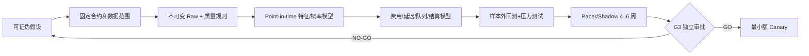
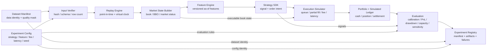

# 软件架构、数据流与生命周期

版本：v0.2｜更新日期：2026-08-21｜状态：Architecture baseline / Partially implemented

## 1. 文档定位和阅读方法

这是项目的**核心共识文档**。它不只说明“代码怎样分包”，还要让产品负责人、
数据工程师、研究员、策略工程师、运维和风控对以下问题使用同一套语言：

1. 事件合约的经济价值和可交易 edge 从哪里来；
2. 为什么必须保存当时真实可见的数据；
3. 怎样把一个直觉变成可证伪的策略假设；
4. 怎样证明结果不是未来数据、过拟合或不现实成交造成的；
5. 数据、回测、paper 和实盘之间的软件组件如何分工。

本文描述目标架构和当前实现边界，不表示 ClickHouse、R2、paper OMS
或 live execution 已经部署。

### 1.1 每个概念的学习模板

新开发者学习本文时，不应只记英文缩写。每个术语都按四层理解：

| 层次 | 需要回答的问题 |
|---|---|
| 通俗理解 | 它像现实生活中的什么？ |
| 精确定义 | 它的输入、输出、时间语义和责任边界是什么？ |
| 项目例子 | 它在 Binance + Polymarket/Predict.fun 链路中如何出现？ |
| 误解风险 | 弄错这个概念会产生什么数据、回测或资金风险？ |

每章开头的“术语导读”给出该章最小前置；第 2 章给出整个系统最核心的共同词汇。

## 2. 核心概念导读

> 本章先掌握：Event Contract、Venue、Reference Source、Market/Outcome、Order Book/BBO、
> RawEventEnvelope、WAL、Canonical Silver、Dataset Manifest、Replay、OMS、Ledger。

| 术语 | 通俗理解 | 精确定义 | 项目中的具体例子 | 误解会导致什么 |
|---|---|---|---|---|
| Event Contract | 对一个可判定问题押 YES/NO | 将可客观判定的事件结果映射为结算现金流的合约；本文默认将成功结算归一化为 1、失败为 0 | “BTC 在截止时间前是否达到阈值”的 YES 份额 | 只看标题不看 rules/oracle/end time，可能交易了语义不同的合约 |
| Prediction Market | 用交易价格汇总大家判断 | 参与者通过买卖事件结果份额聚合信息的市场机制 | Polymarket 中 YES/NO token 的订单簿 | 把价格当成无误差的真实概率，忽略流动性、风险偏好和平台风险 |
| Venue | 具体在哪个场子交易 | 提供市场、行情、订单和结算规则的具体场所 | Polymarket 或 Predict.fun | 以为数据可读就等于账户有资格下单 |
| Reference Source | 给策略提供旁证的市场 | 用于估计标的状态、公平概率或结算条件，但不一定执行事件合约订单的数据源 | Binance BTCUSDT trade/depth/BBO | 将 Binance 的延迟和 Polymarket 的可成交价格混为同一个概念 |
| Market / Outcome | 一道题和它的可选答案 | Market 是共享同一套规则的事件；Outcome 是一个可交易结果 | 同一 BTC 事件下的 YES 和 NO | 只按数组位置猜 YES/NO，导致反向持仓和错误结算 |
| Executable Price | 真拿这个数量去买的均价 | 在给定买卖方向、数量和时刻下，根据订单簿实际可成交的加权价格 | 买 1,000 份 YES 需逐档吃 ask，不是使用中间价 | 使用 last/mid 回测，制造现实中无法成交的利润 |
| Order Book / BBO | 排队中的报价表/最前一档 | Order Book 是按价格聚合的未成交买卖意向；BBO 是其最优 bid/ask | Binance depth/bookTicker；Polymarket YES/NO book | 把报价当成成交，忽略数量、队列、撤单和冲击 |
| Collector | 守着数据连接的采集员 | 管理一个 source/stream 连接生命周期，并在收件边界增加本地时间/session/sequence 的组件 | Binance WebSocket 采集器 | 让 Collector 直接做策略判断或写研究表，造成无法回放和紧耦合 |
| RawEventEnvelope | 原消息外面的标准快递袋 | 保留原 payload，并增加 source、stream、session、source/receive time、sequence 的版本化原始事件契约 | 一条 Binance trade 原消息加本机收件时间 | 只保存解析后字段，parser 错误时无法恢复原始证据 |
| WAL | 数据先落下的防丢流水账 | 以 append-only 方式在下游数据库之前保存已接收事件的本地持久日志 | 64 MiB 默认 Raw NDJSON segment | 直接写 ClickHouse，数据库故障时丢失最重要的原始数据 |
| Manifest | 数据包的封条和装箱单 | 将输入/输出文件、行数、字节、时间范围、schema、commit 和 checksum 绑定的机器可读证据 | Segment/Dataset/Replay Manifest | 只靠文件名管数据，无法证明文件是否被替换或实验用了哪批输入 |
| Canonical Silver | 把不同方言翻成统一事实 | 将不同源中语义明确的市场事件转为共同字段和质量语义的可重建事实层 | Binance trade 和 Polymarket last_trade 都转为 canonical trade | 在统一层猜测未知字段，使不同业务语义看似相同 |
| Quality Mask | 为某类研究规定可用数据 | 在不删除 Raw/Silver 的前提下，按研究用途决定哪些 quality flag 可进入 Dataset 的版本化配置 | strict mask 排除缺 source time 的 BBO | 在 notebook 中临时删行，正式结论无法复现 |
| Frozen Dataset | 封存且有身份证的研究样本 | 范围、输入、schema、quality mask 和代码版本都已固定的研究输入 | Dataset Manifest v2 + deterministic Parquet | 每次重跑都使用不同的“最新数据”，结果无法比较 |
| Point-in-Time | 当时不知道的事不能偷看 | 任意决策时刻只能使用当时已经可见的信息 | 按 `available_at_ms` 而不是更早的 source time 回放 | 把未来消息插入过去，得到无法实现的回测收益 |
| Replay | 用历史录像驱动同一套程序 | 验证 Dataset 后，按 point-in-time 顺序在虚拟时钟上确定性调度事件 | 将冻结的 Binance/Polymarket 事件重放给 Strategy | 把回放当成成交模拟；Replay v1 仍不包含队列、费用和 fill |
| Strategy | 把信息变成交易意图的规则 | 从当前信息集和状态生成 signal/order intent 的可替换组件 | 根据 Binance 变动和 Polymarket 可成交价计算 lead-lag edge | 让 Strategy 自己发 HTTP 订单，会绕过风控、幂等和账本 |
| OMS | 管订单一生的调度员 | 将通过风控的 order intent 管理为幂等、可恢复的订单状态机 | submitted→accepted→partial→filled/cancelled/rejected/unknown | 超时就盲目重试，可能生成重复真实订单 |
| Ledger / Reconciliation | 内部账本和平台对账 | Ledger 是内部订单、成交、费用、资金、持仓、结算事实账；Reconciliation 将它与 venue 真实状态核对 | 对比内部 YES 持仓与平台余额/成交 | 只看策略内存持仓，重启或部分成交后可在错误仓位上继续下单 |

## 3. 事件合约量化的理论基础

> 本章先掌握：Payoff、Implied Probability、Physical/Risk-Neutral Probability、Expected Value、
> Executable Edge、Calibration、No-Arbitrage Constraint、Lead-Lag、Market Microstructure、Tail Risk。

### 3.1 基本现金流和期望价值

将一份 YES 合约成功结算归一化为 1，失败结算为 0。若买入价格为 `a`，不考虑费用：

```text
事件发生时 PnL = 1 - a
事件不发生时 PnL = -a

EV = p * (1 - a) + (1 - p) * (-a) = p - a
```

`p` 是我们在下单时使用当时信息集估计的事件发生概率；`a` 必须是给定数量的
实际可成交 ask/VWAP，不是展示价、last 或 mid。真正的工程决策使用：

```text
可交易 edge
= 模型概率 p
- 实际可成交价格 a
- 手续费
- 滑点与市场冲击
- 延迟与逆向选择成本
- 结算、平台和模型不确定性准备
```

例如模型估计 `p=0.68`，买入目标数量的实际均价是 `a=0.62`，全部费用/滑点/风险
准备为 `0.02`，则净 edge 约为 `0.04/份`。这是长期期望，不是该笔交易必赚 4%。

### 3.2 市场价格不等于客观真实概率

归一化价格可以被解读为 implied probability，但它还受风险偏好、库存、流动性、资金限制、
费用和平台风险影响。传统数字期权定价中的价格更接近折现后的风险中性概率，
而策略要判断的是与现实频率相关、且已经校准的模型概率。

**具体例子**：Polymarket YES 最优卖价为 `0.62`，不表示“客观上精确有 62% 概率”；
它首先表示“此时有人愿意在该数量和价格卖出”。

### 3.3 概率一致性和结构约束

事件合约还有一组不依赖复杂预测模型的数学约束。对一组规则一致、能够同时结算、
且结算现金流都已归一化为 `0/1` 的合约：

```text
单个结果：0 ≤ P(outcome) ≤ 1
二元互补结果：P(YES) + P(NO) = 1
互斥且完备的 N 个结果：Σ P(outcome_i) = 1
嵌套事件 B ⊆ A：P(B) ≤ P(A)
```

这些是**概率约束**，不是看到报价不等就自动套利。可执行条件必须用同一时刻、同一数量的
bid/ask，并扣除费用、冲击、资金占用、结算和单边成交风险。

**具体例子 1：买入互补结果。** 若同一市场的 YES ask 为 `0.47`、NO ask 为 `0.48`，
两边各买一份的总成本为 `0.95`。如果两份能够同时成交，且全部费用、滑点和结算准备合计
小于 `0.05`，到期固定收到 `1`，才可能存在正的可执行 edge。若看到的是两个 mid，或只能
成交一边，则不能称为无风险套利。

**具体例子 2：嵌套事件。** “BTC 到周五高于 100k”是“BTC 到周五高于 90k”的子事件，
前者概率不应高于后者。但只有在两份合约的时区、截止时间、价格源、触发条件和异常结算
条款完全一致时，这个映射才成立；标题相似不是证据。

### 3.4 数据在策略中解决四个不同问题

| 问题 | 要估计的量 | 需要的数据 | 项目例子 |
|---|---|---|---|
| 事件概率 | `p = P(event | information available now)` | 现货、衍生品、事件规则、历史状态 | 用 Binance 短期 return/volatility 估计 BTC 阈值事件概率 |
| 市场报价 | `q(size, side, time)` | 目标 venue 的 book/BBO/trade | 计算买 1,000 份 YES 的逐档 VWAP |
| 执行成本 | fee/slippage/impact/fill/latency | order book delta、队列、ack/fill 和网络时间 | 信号出现后 150 ms 到单时，可成交 ask 已改变 |
| 风险和资金 | 相关性、尾部损失、结算/平台风险 | 持仓、账本、事件依赖、历史极端样本 | 多个 BTC 市场看似分散，实际共享同一尾部风险 |

因此“收集数据”不是策略之外的运维工作；它是估计 `p`、`q`、成本和风险四个项的前提。

### 3.5 首批可证伪策略假设

| 假设 | 精确含义 | 需要的证据 | 主要失败原因 |
|---|---|---|---|
| Spot→Event Lead-Lag | 参考现货变化在 point-in-time 上稳定领先目标 venue 可成交概率变化 | 两源收件时间、时钟误差、book、费用、到单后价格 | 共同新闻、时钟偏差、可成交价已更新、edge 被成本吃掉 |
| 结构约束 | YES/NO、互斥结果或嵌套事件的可成交价违反概率一致性 | 完整 rules/mapping、同时刻买卖盘、费用和可成交数量 | 市场并非互斥/完备、只用 mid、无法同时成交 |
| 跨 Venue 差异 | 语义一致的合约在不同 venue 存在超过全部成本的价差 | 人工批准的 market mapping、两边 book、资金与结算风险 | 规则不同、资金无法即时跨平台转移、一边成交另一边失败 |
| Tail Sweep（仅离线） | 买入极低价结果或卖出极端概率，依赖尾部误定价 | 长周期基准率、结算全样本、极端损失压力测试 | 高胜率掩盖低频巨亏，一次错误抹去大量历史利润 |

Lead-Lag 首先是可预测关系，不自动表示 Binance “因果上导致” Polymarket 变化。

### 3.6 策略开发方法论



1. **提出可证伪假设**：先定义什么观测会证明假设错误，不从好看的收益曲线倒推故事。
2. **固定信息契约**：锁定 market/rules/outcome、数据源、时间范围和 quality mask。
3. **构建 point-in-time 信息集**：任何特征只能读取决策时已经到达的数据。
4. **先验证概率，再验证 PnL**：检查 calibration、Brier/log loss 和分组稳定性，不只看涨跌判断率。
5. **模拟实际执行**：使用可成交 book、费用、滑点、冲击、队列、部分成交和延迟。
6. **冻结样本外和失败实验**：不根据结果反复修改测试集，所有失败参数也进 registry。
7. **压力测试结论**：同时放大费用、延迟、滑点和错误概率，检查是否由单日/单市场贡献全部收益。
8. **用 paper/shadow 比较回测与实时**：解释信号、报价、fill 和 PnL 偏差，而不是直接开 live。

### 3.7 概率预测如何验证

事件合约首先是概率预测问题，因此不能只看“猜对次数”。一个永远预测 51% 的模型，
在正例略多的样本中可能有不错的准确率，却没有足够的交易 edge。至少使用：

```text
Brier score = mean((p - y)^2)          # 越小越好
Log loss    = mean(-y·ln(p) -(1-y)·ln(1-p))  # 越小越好，严惩过度自信
Calibration: 在预测约为 p 的样本组中，实际发生率是否约为 p
```

其中 `p` 是下单时的信息集产生的概率，`y` 是最终结算结果 `0/1`。例如模型对 100 个互相
独立程度足够、都预测约 `0.70` 的事件，长期应有约 70 个发生；若只有 52 个发生，模型明显
过度自信。单一事件无法验证 70% 是否准确，需要足够样本、置信区间和分组稳定性检查。

概率模型优于基准并不等于策略赚钱：它还必须在目标 venue 的可执行价格、费用和风险准备
之后保留正 edge。反过来，一段盈利 PnL 也不能替代 calibration 检验，因为它可能由少数
幸运尾部事件贡献。

### 3.8 策略的验证维度

| 维度 | 核心问题 | 最少证据 |
|---|---|---|
| 数据正确性 | 输入完整吗，时钟和 market mapping 可信吗？ | checksum/lineage、断序/重连、quality report、规则证据 |
| 概率有效性 | 预测 70% 的事件是否约 70% 发生？ | calibration/reliability、Brier、log loss、基准模型对照 |
| 信号稳定性 | 关系是否跨时间、市场和波动区间成立？ | train/validation/test、walk-forward、子样本和敏感性 |
| 执行现实性 | 给定数量真的能在该价格成交吗？ | book replay、queue/fill model、fee/slippage/latency 压力测试 |
| 经济显著性 | 净 edge 是否大于模型误差和运行成本？ | 置信区间、容量、换手、回撤、费用敏感性 |
| 风险集中度 | 收益是否依赖单一事件/日期，多市场是否伪分散？ | 事件贡献度、相关性、尾部场景、fractional Kelly/固定风险对照 |
| 运行可控性 | 故障时能否停止并恢复正确状态？ | paper/shadow、fault injection、OMS unknown state、kill switch、对账 |

策略是一个可检验的决策规则，不是一条历史收益曲线。本项目的第一阶段交付标准因此是
“数据可信、实验可复现、系统可恢复、风险可停止”，而不是短期 PnL。

## 4. 由理论推导的设计原则

> 本章先掌握：Immutable Raw、Point-in-Time、Separation of Concerns、Default Deny、Reproducibility。

- **Raw 是证据，派生数据是解释**：原始消息封存后不修改；Silver、Gold 和特征可重算。
- **先记录，再查询**：ClickHouse 或研究任务失败时，不能阻止行情进入本地 WAL。
- **point-in-time 优先**：回测只允许使用事件当时已对系统可见的信息。
- **数据面与执行面分离**：行情归档不因策略崩溃而停止，交易也不被离线压缩占满资源。
- **实盘默认拒绝**：数据接通、有策略接口或租了服务器，都不等于获得下单授权。
- **所有结论都有身份**：正式数据集和实验绑定 code、config、schema、data、seed 和 artifact hash。

## 5. 主要软件组件与关系

> 本章先掌握：Data Plane、Research Plane、Execution Plane、Control Plane、Adapter、State Store、OMS。

```mermaid
flowchart LR
    SRC["Market data sources<br/>Binance / Polymarket / Predict.fun"]
    COL["Market Data Adapters<br/>connect / subscribe / reconnect"]
    RAW["Raw Event Boundary<br/>RawEventEnvelope"]
    WAL["Recorder<br/>segmented WAL"]
    ARC["Immutable Archive<br/>Raw objects + manifests"]
    NOR["Normalizer + Quality<br/>Canonical Silver"]
    STATE["Current Market State<br/>book / BBO / market status"]
    STR["Strategy SDK<br/>event + state → order intent"]
    MODE{"Mode Router<br/>default deny"}
    RISK["Pre-trade Risk<br/>limits / stale / exposure"]
    OMS["OMS + Venue Adapter<br/>order state machine"]
    VEN["Target Venue<br/>approved order API"]
    LED["Ledger + Reconciliation<br/>orders / fills / balance / settlement"]
    DATA["Research Storage<br/>Parquet datasets + ClickHouse"]
    REP["Replay Engine<br/>point-in-time / virtual clock"]
    SIM["Execution Simulator<br/>fills / fees / latency"]
    EXP["Experiment Registry<br/>config / metrics / artifacts"]
    CTRL["Control + Observability<br/>versioned config / health / audit"]

    SRC -->|"WS / REST payload"| COL
    COL -->|"timestamped event"| RAW
    RAW -->|"append"| WAL
    WAL -->|"sealed segments"| ARC
    WAL -->|"accepted event"| NOR
    NOR -->|"live canonical event"| STATE
    STATE -->|"current information set"| STR
    STR -->|"order intent"| MODE
    MODE -->|"Backtest / Paper"| SIM
    MODE -->|"Shadow: record only"| EXP
    MODE -->|"Live + G3 approval"| RISK
    RISK -->|"approved intent"| OMS
    OMS -->|"submit / cancel"| VEN
    VEN -->|"ack / fill / balance"| OMS
    OMS -->|"state transitions"| LED
    ARC -->|"rebuild / batch normalize"| DATA
    NOR -->|"Silver / quality"| DATA
    DATA -->|"frozen dataset"| REP
    REP -->|"historical canonical event"| STATE
    STATE -->|"historical book state"| SIM
    SIM -->|"simulated fills / PnL"| EXP
    STR -->|"signals / diagnostics"| EXP
    LED -->|"paper/live truth"| EXP
    CTRL -.-> COL
    CTRL -.-> WAL
    CTRL -.-> REP
    CTRL -.-> RISK
    CTRL -.-> OMS
```



图中只有两条策略输入路径：

- **实时路径**：`Normalizer → Current Market State → Strategy`；
- **历史路径**：`Research Storage → Replay → Strategy`。

两条路径最终使用同一 Strategy SDK。Mode Router 对每次运行只选择一个执行出口：
Backtest/Paper 进入模拟器，Shadow 只记录意图，只有实时且通过 G3 的 Live 运行才允许
进入 Risk 和 OMS。Archive/Parquet/ClickHouse 的压缩与查询不在下单同步路径上。
图中的 `WAL → Normalizer` 表示事件先被 Recorder 接受，再进入在线解析；它不要求每条消息
单独 `fsync`，持久化窗口由批量 flush/fsync 策略定义并通过故障测试验证。

### 5.1 组件边界

| 组件 | 精确责任 | 主要输入→输出 | 禁止跨越的边界 |
|---|---|---|---|
| Market Data Adapter/Collector | 连接、订阅、心跳、重连、断序、收件时间 | venue payload→RawEventEnvelope | 不猜测策略语义，不直接写研究表 |
| Recorder/WAL | 单写者、分段、flush/fsync、seal、checksum、崩溃恢复 | RawEventEnvelope→sealed segment+manifest | 不提供大规模查询 |
| Normalizer/Quality | 将官方字段映射为 canonical contract，隔离无效/未知语义 | Raw→Silver+quality+quarantine | 不根据名称猜 market/outcome |
| Archive | 上传不可变 Raw/Parquet，管理 manifest 和生命周期 | sealed segment→verified object | 不成为唯一订单账本 |
| Research Storage | 保存可查询 Silver/Gold 和冻结 Dataset | Silver→ClickHouse/Parquet/Dataset | ClickHouse 不是 Raw 唯一真相源 |
| Replay/Simulation | 按当时可见时间调度事件，逐步注入费用/延迟/成交模型 | Dataset+config→events/fills/report | v1 只实现调度，不宣称已有真实 fill |
| Strategy SDK | 从事件和当前状态生成 signal/order intent | event+state→intent | 不直接调 venue API |
| Mode Router | 根据受控运行配置将 intent 送到模拟、只记录或实盘路径；默认拒绝 live | intent+approved mode→one execution path | 不得同时发送模拟和真实订单；不得由 Strategy 自行选择 live |
| Pre-trade Risk | 检查新鲜度、市场/账户白名单、单笔/库存/日损限额 | intent+positions+limits→approve/reject | 信息缺失时不得默认通过 |
| OMS/Venue Adapter | 幂等提交、撤单、订单状态机和 unknown 恢复 | approved intent→order transitions | 不绕过 Risk；不将超时当成未成交 |
| Ledger/Reconciliation | 记录资金事实，对比 venue 订单/成交/持仓/余额/结算 | transitions+venue state→ledger/exceptions | 不以策略内存状态代替真实账本 |
| Control/Observability | 版本化配置、健康、指标、日志、trace、审批和审计 | config/runtime events→status/audit | 配置变更不能绕过 live 审批 |

## 6. 数据源与角色

> 本章先掌握：Venue、Target Venue、Reference Source、Oracle、Market、Outcome、Token ID、Resolution。

| 数据源 | 角色 | 主要数据 | 当前状态 |
|---|---|---|---|
| Binance | reference price | trade、depth delta、BBO、server time | 公开只读已实采 |
| Polymarket | target venue | market/rules/outcome/token、book、BBO、trade | Gamma/Data/CLOB/Market WS 已实采；正式市场待冻结 |
| Predict.fun | target venue | market contract、book/trade，未来 order lifecycle | 等待官方 Testnet/read-only 授权和样本 |
| Chainlink | oracle | 特定 feed 价格与时间 | 暂缓，等研究问题给出 feed ID |
| Deribit | derivatives reference | index、perpetual、options | 暂缓，等研究问题给出 channel |

Binance 不是事件合约的执行场所，而是首个参考价源。Polymarket 和 Predict.fun
是目标 venue，但只读数据接入不会自动升级为交易资格。

## 7. 为什么以流式采集为主

> 本章先掌握：WebSocket、Snapshot、Delta、Receive Time、Sequence Gap、Silent Window、Backfill、Lead-Lag。

### 7.1 历史下载缺少“当时我们看到了什么”

历史 API 通常只给事件时间或最终整理结果，不会给出我们的收件时间、网络抖动、
断线、重连和当时是否已经可见。对 lead-lag 和延迟研究，“事后知道它何时发生”
不等于“交易时我们何时看到”。

### 7.2 订单簿是过程，不只是结果

订单簿快照只能说明某个时刻的状态。队列变化、撤单、部分成交和短暂的价差
可能在两个快照之间完成。没有流式 delta，就无法可靠重建当时的可成交流动性。

### 7.3 连接质量本身就是 benchmark 数据

正式 benchmark 不只看价格，还要看心跳、静默窗口、重连、重订阅、断序、重复、
解析错误和时钟偏差。这些数据无法从事后下载的成交表中恢复。

### 7.4 流式数据才能驱动实时策略

实盘不会等待每日历史文件生成。如果回测使用的事件契约与实时策略输入不同，
研究到上线会产生很大的语义偏差。

### 7.5 历史下载仍然有价值

流式采集和历史下载不是二选一：

| 任务 | 流式采集 | 历史下载 |
|---|---:|---:|
| 精确收件时间和网络质量 | 必须 | 无法提供 |
| 完整的 book delta/短暂状态 | 优先 | 视平台能力 |
| 市场元数据、规则和结算 | 记录变化 | 适合回补和核对 |
| 历史成交长区间初步研究 | 成本高 | 适合 bootstrap |
| 发现漏段 | 作为主链 | 可回补，但必须标记 backfill |

历史数据也必须进入 `RawEventEnvelope`，记录 `ingest_mode=backfill`、原文件/API、
下载时间和 checksum。回填行不能伪装成当时实时收到的数据，也不能用下载时间
冒充原始可见时间。

## 8. 从收件到研究数据集

> 本章先掌握：Collector、Session、RawEventEnvelope、WAL、Segment、Seal、Manifest、Schema、Lineage、Quarantine、Quality Mask。

```mermaid
flowchart LR
    MSG["Venue message<br/>WS event or REST snapshot"]
    ENV["Collector<br/>add source/session/time/sequence"]
    ACT["Active WAL segment<br/>append-only"]
    SEAL["Segment Sealer<br/>flush + fsync + atomic rename"]
    MAN["Segment Manifest<br/>rows / bytes / range / SHA-256"]
    OBJ["Immutable Raw Object<br/>remote archive"]
    PARSE["Normalizer<br/>contract parser"]
    VALID{"Validation result"}
    QUAR["Quarantine<br/>raw bytes + reason"]
    SIL["Canonical Silver<br/>event + quality flags + lineage"]
    MASK["Dataset Builder<br/>versioned quality mask"]
    PQ["Deterministic Parquet"]
    DM["Dataset Manifest v2"]

    MSG -->|"raw payload"| ENV
    ENV -->|"RawEventEnvelope"| ACT
    ACT -->|"size/time threshold"| SEAL
    SEAL --> MAN
    MAN -->|"upload then verify"| OBJ
    MAN -->|"verified local input"| PARSE
    OBJ -->|"rebuild/backfill input"| PARSE
    PARSE --> VALID
    VALID -->|"invalid or unknown semantics"| QUAR
    VALID -->|"accepted or warned"| SIL
    SIL --> MASK
    MASK --> PQ
    PQ --> DM
```



这张图中，Manifest 是每个跨阶段交付的证据：没有 sealed segment manifest，就不宣称 Raw
已完成；没有 Dataset Manifest，就不宣称该 Parquet 是正式研究输入。

### 8.1 时间语义

| 字段 | 含义 | 用途 |
|---|---|---|
| `source_event_ts_ms` | 源平台声称的事件时间，可为空 | 估计到达延迟，必须附时钟误差 |
| `recv_wall_ts_ms` | 我们收到消息时的墙上时间 | 跨源对照和 point-in-time 可见性 |
| `recv_mono_ns` | 进程内单调时钟 | 精确内部间隔，不受系统校时跳变影响 |
| source sequence/update ID | 源提供的顺序 | 检测断序、重复和重建 order book |

无源时间戳的 BBO 可以用于当时状态和收件频率研究，但不得生成伪造的
单向延迟。时钟门禁未通过时，数据仍可用于完整性和容量测试，但不能发布正式
单向延迟 SLO。

### 8.2 质量处置

- **reject/quarantine**：无效契约、价格范围错误、序列回退、不可解析数据等；
- **warning**：缺源时间、轻微负延迟、单边/空盘口、sequence gap 等；
- **quality mask**：按研究目的决定哪些 warning 可以进入正式 Dataset。

Strict mask 排除所有 warning，适合建立最保守基线，但不应被误解为所有研究的
唯一正确口径。例如只研究 BBO 状态时，可能允许缺源时间，但必须新建并审批
用途特定的 mask，不能修改旧 Dataset 的证据。

## 9. 数据分层与所有权

> 本章先掌握：Raw/Bronze、Canonical/Silver、Serving/Gold、Frozen Dataset、Execution Record、Rebuildable Data。

| 层 | 通俗理解 | 内容 | 是否可重建 | 主要消费者 |
|---|---|---|---:|---|
| Raw/Bronze | 原始录像 | 原 payload、收件时间、session、sequence、连接事件 | 否 | 恢复、审计、parser 重算 |
| Canonical/Silver | 统一字幕 | trade、book、BBO、market status、quality、lineage | 是 | 热查询、Dataset、Replay |
| Serving/Gold | 按问题剪辑 | bar、spread、return、volatility、lead-lag、研究标签 | 是 | 特征和报告 |
| Frozen Dataset | 封存版研究样本 | Parquet、quality mask、范围、hash、commit | 应与原输入一致重现 | 正式实验与回测 |
| Execution records | 资金账本 | intent、risk decision、order、ack、fill、fee、position、settlement | 否 | OMS、Risk、Ledger、对账 |

Raw 和 execution records 不能因为“已经生成 Parquet”就直接删除。Silver/Gold 可以从上游
重算，因此可以用更短的热保留期。真实订单和账本不使用普通行情删除规则，
保留期必须在 G3 由法务/税务/合规单独决定。

## 10. 对象、目录和 Manifest 管理

> 本章先掌握：Parquet、Object Storage、Partition、Artifact、Checksum/SHA-256、Content-Addressed、Small Object Problem。

目标对象 key/分区方式：

```text
raw/schema=v1/source=<source>/stream=<stream>/date=YYYY-MM-DD/hour=HH/<segment>.ndjson.zst
silver/schema=v1/source=<source>/date=YYYY-MM-DD/hour=HH/<part>.parquet
quality/policy=<version>/date=YYYY-MM-DD/<report>.json
datasets/<dataset_id>/dataset-manifest.json
datasets/<dataset_id>/<part>.parquet
experiments/<experiment_id>/experiment-manifest.json
replays/<replay_id>/replay-manifest.json
```

这是目标布局；当前本地 v1 使用单个 transform manifest 生成单个 Parquet，多 segment
分区和对象上传尚未实现。

每个正式对象至少绑定：

- schema/builder 版本和 Git commit；
- source、stream、market、时间范围；
- 行数、字节数和 SHA-256；
- 输入 manifest/hash、质量规则和输出 artifact；
- 上传、校验和生命周期状态。

删除本地 WAL 前，必须确认远端对象存在、大小和 checksum 一致，且 manifest
已封存。只有“上传返回 200”不足以触发删除。

## 11. 数据生命周期

> 本章先掌握：Hot/Cold Storage、Retention、TTL、Lifecycle Policy、Legal Hold、Archive Verification。

### 11.1 建议默认值

| 数据 | 热保留 | 冷保留 | 到期动作 |
|---|---:|---:|---|
| Active/sealed WAL | 24–72 小时 | 远端 Raw 已验证前不得删 | 上传+校验后滚动删除本地段 |
| Immutable Raw | 无需长期热存 | 初始 12 个月 | 30 天实测后审核分源保留/降采样 |
| Canonical Silver | ClickHouse 30–60 天 | 初始 Parquet 12 个月；冻结 Dataset 可更长 | 可从 Raw 重建；30 天后按重算成本审核 |
| Gold/features | 30–90 天 | 正式实验引用期 | 可从 Silver 重建 |
| Quarantine | 30 天 | 12 个月 | 调查或 parser 修复后重放；不静默删除 |
| Frozen Dataset | 按研究活跃度 | 正式结论和审计所需期限 | 删除前确认可从冻结输入重建 |
| Replay debug output | 7–30 天 | 通常不需要 | 保留 manifest，需要时重建 |
| Formal experiment output | 实验活跃期 | 与正式结论一致 | 保留 manifest、报告和必要 artifact |
| Order/Ledger/Audit | 待 G3 定义 | 待法务/税务/合规定义 | 不得套用普通行情 TTL |

这些是规划默认值，不是永久不变的规则。每个正式 Dataset 应能通过 manifest
覆盖普通 TTL，防止仍被实验引用的输入被生命周期策略删除。

### 11.2 状态转换

```text
ACTIVE WAL
  → SEALED
  → CHECKSUM VERIFIED
  → ARCHIVE UPLOADED
  → ARCHIVE VERIFIED
  → LOCAL WAL EXPIRED
  → COLD RETENTION
  → REVIEW / LEGAL HOLD / DELETE
```

任何对象只要缺 manifest、checksum 失配、正被 Dataset 引用或处于人工 hold，就不能
进入 DELETE。删除是单独的可审计任务，不由采集器边写边删。

## 12. 容量模型与存储设备

> 本章先掌握：Throughput、Compression Ratio、Peak/Sustained Rate、Merge Overhead、Disk Watermark、Capacity Forecast。

### 12.1 当前本地实测

2026-08-21 的 15 分钟只读预检观察到：

| 指标 | 数值 |
|---|---:|
| 观察窗口 | 899.6 s |
| Raw 事件 | 223,165 |
| 平均速率 | 约 248 events/s |
| Raw NDJSON | 128.8 MB |
| 按同速率外推 | 约 12.4 GB/day，一年约 4.5 TB 未压缩 Raw |
| Canonical NDJSON | 200.1 MB |
| strict Dataset | 4,912 行，1.08 MB Parquet |

strict Parquet 仅包含通过严格质量掩码的约 2.2% 事件，不能用它的大小
代表完整 Raw 归档压缩比。正式容量模型仍需 24h/7d 和全量 Raw Parquet
实测。

容量公式：

```text
daily_raw_bytes = observed_bytes / observed_seconds * 86,400
required_wal = peak_daily_raw * wal_days * safety_factor
hot_capacity = daily_silver_compressed * hot_days * merge_overhead
cold_capacity = daily_raw_compressed * retention_days
```

规划使用 `safety_factor = 1.5–2.0`，ClickHouse merge/temporary 空间单独计算，不把字节
外推精确到不存在的小数位。

### 12.2 设备与介质选择

| 用途 | 建议介质 | 初始配置 | 原因 |
|---|---|---:|---|
| Active WAL | 本地 SSD/gp3，不用网络文件系统 | S0 200 GB；长期按 3 天峰值+50% | 需要稳定 append/fsync，断网仍可写 |
| 转换临时区 | 本地 SSD | 至少 1–2 倍当日 Raw | NDJSON、Silver、Parquet 转换期可同时存在 |
| ClickHouse hot | gp3/NVMe 类块存储 | 先 1–2 TB，实测后扩到 4 TB | 需要稳定随机读、merge 和查询 |
| Raw/Parquet archive | R2/S3 对象存储 | 按用量增长，不预购整块盘 | 便宜、耐久、适合大对象和生命周期 |
| Ledger/config metadata | 可备份数据库 | 小容量，高一致性 | 不能从行情 Raw 重建 |

本地 24h 按当前会同时保留 capture、WAL 副本、Silver 和回放产物的验证流程，
建议至少预留 **60 GB** 可用空间。正式 runner 改为直接分段 WAL、及时归档后，
可降低临时放大。7 天本地连续保留所有派生文件时，建议使用 300–500 GB
独立 SSD；不应默默填满系统盘。

### 12.3 分段和磁盘门禁

- segment/object 目标 64–256 MB，避免无上限小对象；
- 剩余空间低于 30% 告警，低于 15% 停止非关键回补/转换；
- 每 source/stream 有独立配额，单个高频流不得吃掉全部空间；
- 扩容由 7–14 天预测触发，不等到盘满后人工抢救；
- 执行节点与大规模压缩/ClickHouse merge 长期分离，避免 I/O 拖慢下单路径。

## 13. 回测如何使用数据

> 本章先掌握：Dataset Manifest、Replay、Virtual Clock、Point-in-Time Join、Feature Version、Execution Simulator、Look-Ahead Bias、Experiment Manifest。



回测不是 `Dataset → PnL` 的黑盒。中间必须显式存在市场状态、特征、策略意图、
执行模拟和账本；否则无法判断收益来自预测能力，还是不现实的成交假设。

### 13.1 每层数据的作用

- Raw：调试 parser、证明当时原始消息、重算 Silver；
- Silver：事件回放、重建 book/market state、跨源 point-in-time join；
- Gold：供研究高效读取的 return、spread、volatility、lead-lag 等派生值；
- Dataset Manifest：冻结研究范围、质量掩码、输入 hash 和代码版本；
- market rules/resolution：判定事件合约是否结算、何时结算、最终现金流；
- fee/latency model：将“理论价差”转换为“实际可交易 edge”。

### 13.2 必须防止的回测偏差

- 使用事后修正的 market metadata，却不记录修正当时是否已可见；
- 用 source time 排序代替收件可见时间，导致未来数据泄漏；
- 用 OHLC 代替订单簿，或假设触价后数量全部成交；
- 忽略费用、滑点、冲击、队列、部分成交、撤单在途和结算风险；
- 在 notebook 中手工删掉亏损日/坏数据，却没有版本化 quality mask；
- 只保留成功参数，丢弃失败实验，导致选择偏差。

当前 Replay v1 已实现 Dataset 校验、point-in-time 排序、虚拟时钟和确定性输出；
book state、费用、滑点、队列、部分成交和结算仍是后续回测消费者的工作。

## 14. Paper 和实盘如何使用数据

> 本章先掌握：Backtest、Paper、Shadow、Live、Canary、Strategy SDK、Order Intent、Pre-trade Risk、Venue Adapter、OMS、Ledger/Reconciliation、Kill Switch。

### 14.1 同一策略契约，不同时钟和执行器

| 模式 | 事件来源 | 时钟 | 执行 Adapter | 资金 |
|---|---|---|---|---:|
| Backtest | Frozen Dataset/Replay | 虚拟时钟 | Execution simulator | $0 |
| Paper | 实时 canonical events | 真实时钟 | Paper venue simulator | $0 |
| Shadow | 实时 canonical events | 真实时钟 | 记录意图，不发送 | $0 |
| Live | 实时 canonical events | 真实时钟 | 官方 Venue Adapter | 受审批限额 |

Strategy 不应知道当前运行在 Replay 还是 Live；它接收同样的 canonical event/state，
输出同样的 signal/order intent。模式差异由 Clock、Market Data Adapter 和 Venue Adapter
注入，从而减少“回测一套、实盘另一套”。

### 14.2 实时数据路径

```text
Venue WS
  → Collector + Raw envelope
  → bounded recorder/WAL path
  → online normalizer + current book/market state
  → Strategy signal
  → pre-trade Risk
  → OMS
  → Paper/Shadow or approved Live Adapter
  → ack/fill/balance/settlement
  → Ledger + Reconciliation + audit
```

冷存储上传、Parquet 压缩和 ClickHouse merge 不进入下单的同步关键路径。但是原始消息、
策略意图、风控结果、订单请求、ack 和 fill 都必须进入可恢复的本地记录/账本路径。

### 14.3 实盘不能只依赖历史数据

实盘在下单前必须另外检查：

- 当前 market/rules/outcome mapping 是否仍然有效；
- book 是否 stale，sequence 是否连续，是否正在重连/重建；
- 当前费率、额度、余额、持仓、日损和地域/账户资格；
- 订单是否幂等，是否存在 unknown/partial/cancel-in-flight 状态；
- ledger 和 venue 余额/持仓是否已对账。

任意一项不可确认时，默认停止新增风险敞口，而不是“先下单再说”。

## 15. 故障和恢复边界

> 本章先掌握：Backpressure、Fail Closed、Schema Drift、Stale State、RPO/RTO、Fault Injection、Unknown Order State。

| 故障 | 期望行为 |
|---|---|
| ClickHouse 不可用 | WAL 继续写；热库恢复后从 manifest 回补 |
| 对象存储不可用 | 本地 sealed WAL 累积并告警；低水位停非关键回补 |
| 源断线 | 记录 close/error、退避重连、新 session；不伪造无缝数据 |
| sequence gap | 标记质量；需要时重拉 snapshot；旧 book 不驱动新风险 |
| schema drift | 未知数据进 quarantine；Raw payload 保留；升级 parser 后重放 |
| 时钟超标 | 完整性采集可继续；停止正式单向延迟结论和依赖该 SLO 的策略 |
| 磁盘逼近满 | 告警、停止非关键任务；不静默丢弃已接收事件 |
| OMS 订单状态未知 | 停止同市场新风险，通过 user stream/REST/账本对账恢复 |

Raw archive 是 ClickHouse 空库恢复的根；Ledger 和审批记录不能从 Raw 行情恢复，因此
它们需要独立备份、一致性和 RPO/RTO 策略。

## 16. 当前实现边界

| 能力 | 状态 |
|---|---|
| Binance/Polymarket 公共只读实采 | 已实现 |
| RawEventEnvelope、分段 WAL、seal/verify/崩溃尾恢复 | 已实现 |
| Canonical Silver、quality/quarantine、逐行 lineage | 已实现 |
| 确定性 Parquet、Dataset Manifest v2、Replay v1 | 已实现 |
| 15 分钟双源本地预检 | 数据链路通过；时钟/系统 DNS 仍需整改 |
| 24h soak runner、周期时钟/容量报告 | 待实现/验收 |
| 多 segment Dataset、R2/S3 archive | 待实现 |
| ClickHouse hot/Gold、空库恢复 | 候选 DDL 已有，实例和演练待完成 |
| Execution simulator、paper OMS、Risk/Ledger | 待实现 |
| Live execution | 默认禁止，尚未授权 |

## 17. 推荐实施顺序

1. 修正本地时钟/DNS，冻结首个 Polymarket 正式市场；
2. 实现分段、可恢复的 24h soak runner 和容量报告；
3. 实现多 segment Dataset 和全量 Raw Parquet，测准压缩比；
4. 评审对象 key、retention policy、R2/S3 选择和空库恢复方案；
5. 完成部署 artifact/IaC，再申请 14 天云 benchmark；
6. 使用 24h/7d 数据定 ClickHouse 分区/排序键和 Gold 表；
7. 在 Replay 上增加 book state、费用、延迟、滑点和部分成交；
8. 建设 paper/shadow OMS、Risk、Ledger 和对账，连续运行 4–6 周；
9. 只有 G3 的资格、账户、限额、kill switch 和对账全部通过，才单独评审 canary。

## 18. 扩展术语速查

本表补充后续章节频繁出现、但不适合全部放进第 2 章的工程术语。评审设计或实验时，
如果对某个词的理解不一致，应以此处定义和相应契约文档为准。

| 术语 | 精确定义 | 本项目中的具体例子 | 常见误解 |
|---|---|---|---|
| WebSocket / REST | WebSocket 是长连接双向消息通道；REST 是一次请求对应一次响应的接口风格 | 用 Market WS 收连续 book 事件，用 REST 拉初始 snapshot/metadata | WS 一连上就必然连续；REST 返回的是历史上当时可见状态 |
| Snapshot / Delta | Snapshot 是某版本的完整状态；Delta 是相对已知状态的增量变更，通常依赖连续 sequence | 先取 order book snapshot，再按 update ID 应用 depth delta | 任意 delta 都能脱离基准独立解释 |
| Source / Receive / Available Time | Source time 由平台声明；receive time 是本机收件时刻；available time 是数据通过规定处理边界、可供决策的最早时刻 | Binance trade 的源时间早于本机收件时间；Replay 按 `available_at_ms` 调度 | 用更早的 source time 回放，就代表策略当时已经看到消息 |
| Sequence Gap / Duplicate | Gap 表示期望序号与收到序号不连续；duplicate 表示同一源身份的事件重复到达 | WS 重连后 update ID 跳号，必须标记并按 venue 规则重建 book | TCP 有序就等于业务事件永不漏失/重复 |
| Backfill | 运行后从历史接口或文件补入缺失区间，并明确保留“事后获得”的可见性语义 | REST 下载漏掉的 trades，在扩展字段记录 `ingest_mode=backfill` | 回填数据可以伪装成当时实时收件数据用于延迟回测 |
| Schema Drift | 上游字段、类型、枚举或语义发生未预期变化 | `price` 从字符串变为 null，或新增未知 market status | parser 没报错就说明语义没有变化 |
| Lineage | 每一派生行到原始输入、转换版本和配置的可验证映射 | Silver 行记录 Raw segment/hash/row 与 parser commit | 只记录“来自 Binance”就足够重现 |
| Quarantine | 保留无法安全解释的数据及原因，禁止其静默进入正式数据集 | 未知 outcome 枚举保留 raw bytes 和 reject code | quarantine 等于可以直接删除的脏数据 |
| Parquet | 列式、带 schema 的分析文件格式，适合压缩和扫描；它不是数据库或数据身份本身 | 将通过 mask 的 canonical events 确定性写入 Dataset part | 有 `.parquet` 后缀就代表数据可信、完整且可复现 |
| Object Storage | 以不可变对象 key 管理大文件的远端存储，不提供本地块设备的 append/fsync 语义 | R2/S3 保存 sealed Raw 和 Dataset artifact | 直接把活跃 WAL 写在对象存储上等价于本地 SSD |
| ClickHouse | 面向列式分析查询的数据库；本项目中是可从 Raw/manifest 重建的热查询层 | 查询 60 天 Silver、spread 和质量统计 | ClickHouse 是 Raw 唯一真相源或 OMS 账本 |
| Slippage / Impact | Slippage 是决策价与实际成交价的差；impact 是本次订单自身消耗流动性引起的价格变化 | 1,000 份 YES 跨三档成交，VWAP 高于信号时 best ask | 两者都等于固定手续费 |
| Adverse Selection | 成交更容易发生在对手掌握更新信息、价格即将朝不利方向变化的时候 | Binance 急涨后挂出的旧 YES ask 被吃到，但后续无法继续按该价买入 | 回测能触价成交就代表该 fill 没有选择偏差 |
| Paper / Shadow | Paper 用实时行情和模拟成交产生虚拟持仓；Shadow 只记录若真实运行会产生的意图，不假定成交 | Paper 验证 OMS 状态机，Shadow 对比信号与真实 book 演变 | Paper 盈利等于真实账户能获得同样 fill |
| Canary / Kill Switch | Canary 是经审批的最小资金实盘阶段；Kill Switch 是阻止新增风险并执行规定撤单/降险动作的独立控制 | 初始不超过批准额度；时钟、book、对账异常触发停单 | Kill switch 只是策略代码里的一个布尔变量 |
| RPO / RTO | RPO 是可接受的数据损失窗口；RTO 是故障后恢复服务的目标时间 | WAL 批量 fsync 决定采集 RPO，manifest 重建演练测量 RTO | 做了备份就自然满足恢复目标 |

## 19. 相关契约和文档

- [`SYSTEM_ARCHITECTURE.md`](SYSTEM_ARCHITECTURE.md)：组件与部署拓扑；
- [`CANONICAL_DATA_MODEL.md`](CANONICAL_DATA_MODEL.md)：Canonical Silver 字段和质量语义；
- [`DATASET_AND_REPLAY.md`](DATASET_AND_REPLAY.md)：Parquet、Dataset Manifest 和 Replay v1；
- [`INFRASTRUCTURE_CAPACITY_AND_COST.md`](../requirements/INFRASTRUCTURE_CAPACITY_AND_COST.md)：容量、云资源和成本边界；
- [`DEVELOPMENT_READINESS.md`](../requirements/DEVELOPMENT_READINESS.md)：本地、上云和实盘门禁；
- [`MANUAL_ACTION_GUIDE.md`](../runbooks/MANUAL_ACTION_GUIDE.md)：必须人工决策和完成证据。
