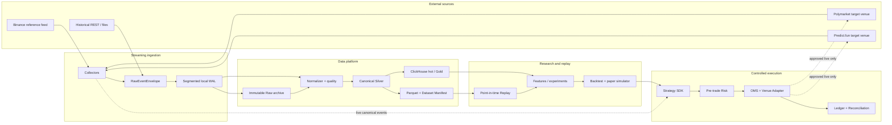
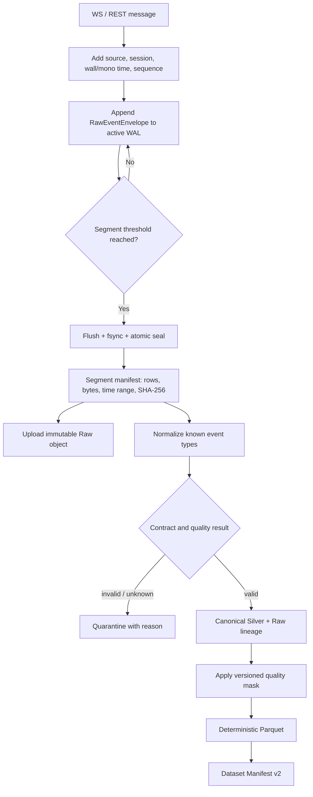

# 软件架构、数据流与生命周期

版本：v0.1｜更新日期：2026-08-21｜状态：Architecture baseline / Partially implemented

## 1. 文档目的

本文档回答五个问题：

1. 系统由哪些组件组成，数据如何流动；
2. 为什么核心行情要流式采集，不能只下载历史数据；
3. 采集后的 Raw、Silver、Gold 和 Dataset 怎样管理；
4. WAL、热库和对象存储各自保留多久，存储设备怎样配置；
5. 回测、paper 和实盘如何使用同一数据契约，又保持风险隔离。

本文描述的是目标架构和当前实现边界，不表示 ClickHouse、R2、paper OMS
或 live execution 已经部署。

## 2. 设计原则

- **Raw 是证据，派生数据是解释**：原始消息封存后不修改；Silver、Gold 和特征可重算。
- **先记录，再查询**：ClickHouse 或研究任务失败时，不能阻止行情进入本地 WAL。
- **point-in-time 优先**：回测只允许使用事件当时已对系统可见的信息。
- **数据面与执行面分离**：行情归档不因策略崩溃而停止，交易也不被离线压缩占满资源。
- **实盘默认拒绝**：数据接通、有策略接口或租了服务器，都不等于获得下单授权。
- **所有结论都有身份**：正式数据集和实验绑定 code、config、schema、data、seed 和 artifact hash。

## 3. 整体软件架构



这个架构可以用一句话概括：

```text
将市场现场保存成可验证的原始证据，
再将证据转换成可查询、可冻结、可回放的研究输入，
最后才把通过验证的策略接入受控执行系统。
```

### 3.1 组件边界

| 组件 | 负责什么 | 不负责什么 |
|---|---|---|
| Collector | 连接、订阅、心跳、重连、断序、收件时间 | 不猜测策略语义，不直接写研究表 |
| WAL writer | 单写者、分段、flush/fsync、seal、checksum、崩溃恢复 | 不提供大规模查询 |
| Normalizer | 将官方字段映射到 canonical contract，标记 warning/quarantine | 不根据名称猜 market/outcome |
| Archive | 上传不可变 Raw/Parquet，管理 manifest 和生命周期 | 不成为唯一订单账本 |
| ClickHouse | 最近数据、快速聚合、质量/延迟/特征查询 | 不是 Raw 的唯一真相源 |
| Dataset builder | 应用版本化 quality mask，冻结 Parquet 和 Dataset Manifest | 不允许 notebook 手工删行后冒充正式数据集 |
| Replay | 按当时可见时间调度事件，提供虚拟时钟 | v1 不模拟费用、队列和成交 |
| Strategy | 从事件和当前状态生成 signal/order intent | 不直接越过 Risk/OMS 调 venue API |
| OMS/Risk/Ledger | 限额、订单状态、成交、费用、持仓、结算与对账 | 不由研究 notebook 临时开关实盘 |

## 4. 数据源与角色

| 数据源 | 角色 | 主要数据 | 当前状态 |
|---|---|---|---|
| Binance | reference price | trade、depth delta、BBO、server time | 公开只读已实采 |
| Polymarket | target venue | market/rules/outcome/token、book、BBO、trade | Gamma/Data/CLOB/Market WS 已实采；正式市场待冻结 |
| Predict.fun | target venue | market contract、book/trade，未来 order lifecycle | 等待官方 Testnet/read-only 授权和样本 |
| Chainlink | oracle | 特定 feed 价格与时间 | 暂缓，等研究问题给出 feed ID |
| Deribit | derivatives reference | index、perpetual、options | 暂缓，等研究问题给出 channel |

Binance 不是事件合约的执行场所，而是首个参考价源。Polymarket 和 Predict.fun
是目标 venue，但只读数据接入不会自动升级为交易资格。

## 5. 为什么以流式采集为主

### 5.1 历史下载缺少“当时我们看到了什么”

历史 API 通常只给事件时间或最终整理结果，不会给出我们的收件时间、网络抖动、
断线、重连和当时是否已经可见。对 lead-lag 和延迟研究，“事后知道它何时发生”
不等于“交易时我们何时看到”。

### 5.2 订单簿是过程，不只是结果

订单簿快照只能说明某个时刻的状态。队列变化、撤单、部分成交和短暂的价差
可能在两个快照之间完成。没有流式 delta，就无法可靠重建当时的可成交流动性。

### 5.3 连接质量本身就是 benchmark 数据

正式 benchmark 不只看价格，还要看心跳、静默窗口、重连、重订阅、断序、重复、
解析错误和时钟偏差。这些数据无法从事后下载的成交表中恢复。

### 5.4 流式数据才能驱动实时策略

实盘不会等待每日历史文件生成。如果回测使用的事件契约与实时策略输入不同，
研究到上线会产生很大的语义偏差。

### 5.5 历史下载仍然有价值

流式采集和历史下载不是二选一：

| 任务 | 流式采集 | 历史下载 |
|---|---:|---:|
| 精确收件时间和网络质量 | 必须 | 无法提供 |
| 完整的 book delta/短暂状态 | 优先 | 视平台能力 |
| 市场元数据、规则和结算 | 记录变化 | 适合回补和核对 |
| 历史成交长区间初步研究 | 成本高 | 适合 bootstrap |
| 发现漏段 | 作为主链 | 可回补，但必须标记 backfill |

历史数据也必须进入 `RawEventEnvelope`，记录 `ingest_mode=backfill`、原文件/API、
下载时间和 checksum。回填行不能伪装成当时实时收到的数据，也不能用下载时间
冒充原始可见时间。

## 6. 从收件到研究数据集



### 6.1 时间语义

| 字段 | 含义 | 用途 |
|---|---|---|
| `source_event_ts_ms` | 源平台声称的事件时间，可为空 | 估计到达延迟，必须附时钟误差 |
| `recv_wall_ts_ms` | 我们收到消息时的墙上时间 | 跨源对照和 point-in-time 可见性 |
| `recv_mono_ns` | 进程内单调时钟 | 精确内部间隔，不受系统校时跳变影响 |
| source sequence/update ID | 源提供的顺序 | 检测断序、重复和重建 order book |

无源时间戳的 BBO 可以用于当时状态和收件频率研究，但不得生成伪造的
单向延迟。时钟门禁未通过时，数据仍可用于完整性和容量测试，但不能发布正式
单向延迟 SLO。

### 6.2 质量处置

- **reject/quarantine**：无效契约、价格范围错误、序列回退、不可解析数据等；
- **warning**：缺源时间、轻微负延迟、单边/空盘口、sequence gap 等；
- **quality mask**：按研究目的决定哪些 warning 可以进入正式 Dataset。

Strict mask 排除所有 warning，适合建立最保守基线，但不应被误解为所有研究的
唯一正确口径。例如只研究 BBO 状态时，可能允许缺源时间，但必须新建并审批
用途特定的 mask，不能修改旧 Dataset 的证据。

## 7. 数据分层与所有权

| 层 | 通俗理解 | 内容 | 是否可重建 | 主要消费者 |
|---|---|---|---:|---|
| Raw/Bronze | 原始录像 | 原 payload、收件时间、session、sequence、连接事件 | 否 | 恢复、审计、parser 重算 |
| Canonical/Silver | 统一字幕 | trade、book、BBO、market status、quality、lineage | 是 | 热查询、Dataset、Replay |
| Serving/Gold | 按问题剪辑 | bar、spread、return、volatility、lead-lag、研究标签 | 是 | 特征和报告 |
| Frozen Dataset | 封存版研究样本 | Parquet、quality mask、范围、hash、commit | 应与原输入一致重现 | 正式实验与回测 |
| Execution records | 资金账本 | intent、risk decision、order、ack、fill、fee、position、settlement | 否 | OMS、Risk、Ledger、对账 |

Raw 和 execution records 不能因为“已经生成 Parquet”就直接删除。Silver/Gold 可以从上游
重算，因此可以用更短的热保留期。真实订单和账本不使用普通行情删除规则，
保留期必须在 G3 由法务/税务/合规单独决定。

## 8. 对象、目录和 Manifest 管理

目标对象 key/分区方式：

```text
raw/schema=v1/source=<source>/stream=<stream>/date=YYYY-MM-DD/hour=HH/<segment>.ndjson.zst
silver/schema=v1/source=<source>/date=YYYY-MM-DD/hour=HH/<part>.parquet
quality/policy=<version>/date=YYYY-MM-DD/<report>.json
datasets/<dataset_id>/dataset-manifest.json
datasets/<dataset_id>/<part>.parquet
experiments/<experiment_id>/experiment-manifest.json
replays/<replay_id>/replay-manifest.json
```

这是目标布局；当前本地 v1 使用单个 transform manifest 生成单个 Parquet，多 segment
分区和对象上传尚未实现。

每个正式对象至少绑定：

- schema/builder 版本和 Git commit；
- source、stream、market、时间范围；
- 行数、字节数和 SHA-256；
- 输入 manifest/hash、质量规则和输出 artifact；
- 上传、校验和生命周期状态。

删除本地 WAL 前，必须确认远端对象存在、大小和 checksum 一致，且 manifest
已封存。只有“上传返回 200”不足以触发删除。

## 9. 数据生命周期

### 9.1 建议默认值

| 数据 | 热保留 | 冷保留 | 到期动作 |
|---|---:|---:|---|
| Active/sealed WAL | 24–72 小时 | 远端 Raw 已验证前不得删 | 上传+校验后滚动删除本地段 |
| Immutable Raw | 无需长期热存 | 初始 12 个月 | 30 天实测后审核分源保留/降采样 |
| Canonical Silver | ClickHouse 30–60 天 | 初始 Parquet 12 个月；冻结 Dataset 可更长 | 可从 Raw 重建；30 天后按重算成本审核 |
| Gold/features | 30–90 天 | 正式实验引用期 | 可从 Silver 重建 |
| Quarantine | 30 天 | 12 个月 | 调查或 parser 修复后重放；不静默删除 |
| Frozen Dataset | 按研究活跃度 | 正式结论和审计所需期限 | 删除前确认可从冻结输入重建 |
| Replay debug output | 7–30 天 | 通常不需要 | 保留 manifest，需要时重建 |
| Formal experiment output | 实验活跃期 | 与正式结论一致 | 保留 manifest、报告和必要 artifact |
| Order/Ledger/Audit | 待 G3 定义 | 待法务/税务/合规定义 | 不得套用普通行情 TTL |

这些是规划默认值，不是永久不变的规则。每个正式 Dataset 应能通过 manifest
覆盖普通 TTL，防止仍被实验引用的输入被生命周期策略删除。

### 9.2 状态转换

```text
ACTIVE WAL
  → SEALED
  → CHECKSUM VERIFIED
  → ARCHIVE UPLOADED
  → ARCHIVE VERIFIED
  → LOCAL WAL EXPIRED
  → COLD RETENTION
  → REVIEW / LEGAL HOLD / DELETE
```

任何对象只要缺 manifest、checksum 失配、正被 Dataset 引用或处于人工 hold，就不能
进入 DELETE。删除是单独的可审计任务，不由采集器边写边删。

## 10. 容量模型与存储设备

### 10.1 当前本地实测

2026-08-21 的 15 分钟只读预检观察到：

| 指标 | 数值 |
|---|---:|
| 观察窗口 | 899.6 s |
| Raw 事件 | 223,165 |
| 平均速率 | 约 248 events/s |
| Raw NDJSON | 128.8 MB |
| 按同速率外推 | 约 12.4 GB/day，一年约 4.5 TB 未压缩 Raw |
| Canonical NDJSON | 200.1 MB |
| strict Dataset | 4,912 行，1.08 MB Parquet |

strict Parquet 仅包含通过严格质量掩码的约 2.2% 事件，不能用它的大小
代表完整 Raw 归档压缩比。正式容量模型仍需 24h/7d 和全量 Raw Parquet
实测。

容量公式：

```text
daily_raw_bytes = observed_bytes / observed_seconds * 86,400
required_wal = peak_daily_raw * wal_days * safety_factor
hot_capacity = daily_silver_compressed * hot_days * merge_overhead
cold_capacity = daily_raw_compressed * retention_days
```

规划使用 `safety_factor = 1.5–2.0`，ClickHouse merge/temporary 空间单独计算，不把字节
外推精确到不存在的小数位。

### 10.2 设备与介质选择

| 用途 | 建议介质 | 初始配置 | 原因 |
|---|---|---:|---|
| Active WAL | 本地 SSD/gp3，不用网络文件系统 | S0 200 GB；长期按 3 天峰值+50% | 需要稳定 append/fsync，断网仍可写 |
| 转换临时区 | 本地 SSD | 至少 1–2 倍当日 Raw | NDJSON、Silver、Parquet 转换期可同时存在 |
| ClickHouse hot | gp3/NVMe 类块存储 | 先 1–2 TB，实测后扩到 4 TB | 需要稳定随机读、merge 和查询 |
| Raw/Parquet archive | R2/S3 对象存储 | 按用量增长，不预购整块盘 | 便宜、耐久、适合大对象和生命周期 |
| Ledger/config metadata | 可备份数据库 | 小容量，高一致性 | 不能从行情 Raw 重建 |

本地 24h 按当前会同时保留 capture、WAL 副本、Silver 和回放产物的验证流程，
建议至少预留 **60 GB** 可用空间。正式 runner 改为直接分段 WAL、及时归档后，
可降低临时放大。7 天本地连续保留所有派生文件时，建议使用 300–500 GB
独立 SSD；不应默默填满系统盘。

### 10.3 分段和磁盘门禁

- segment/object 目标 64–256 MB，避免无上限小对象；
- 剩余空间低于 30% 告警，低于 15% 停止非关键回补/转换；
- 每 source/stream 有独立配额，单个高频流不得吃掉全部空间；
- 扩容由 7–14 天预测触发，不等到盘满后人工抢救；
- 执行节点与大规模压缩/ClickHouse merge 长期分离，避免 I/O 拖慢下单路径。

## 11. 回测如何使用数据

```mermaid
flowchart LR
    A["Frozen Dataset Manifest"] --> B["Verify hashes and schemas"]
    B --> C["Point-in-time Replay"]
    C --> D["Book / market state builder"]
    D --> E["Versioned features"]
    E --> F["Strategy signal"]
    F --> G["Execution simulator"]
    G --> H["Orders / partial fills / fees / settlement"]
    H --> I["PnL, risk, capacity, sensitivity report"]
    I --> J["Experiment Manifest"]
```



### 11.1 每层数据的作用

- Raw：调试 parser、证明当时原始消息、重算 Silver；
- Silver：事件回放、重建 book/market state、跨源 point-in-time join；
- Gold：供研究高效读取的 return、spread、volatility、lead-lag 等派生值；
- Dataset Manifest：冻结研究范围、质量掩码、输入 hash 和代码版本；
- market rules/resolution：判定事件合约是否结算、何时结算、最终现金流；
- fee/latency model：将“理论价差”转换为“实际可交易 edge”。

### 11.2 必须防止的回测偏差

- 使用事后修正的 market metadata，却不记录修正当时是否已可见；
- 用 source time 排序代替收件可见时间，导致未来数据泄漏；
- 用 OHLC 代替订单簿，或假设触价后数量全部成交；
- 忽略费用、滑点、冲击、队列、部分成交、撤单在途和结算风险；
- 在 notebook 中手工删掉亏损日/坏数据，却没有版本化 quality mask；
- 只保留成功参数，丢弃失败实验，导致选择偏差。

当前 Replay v1 已实现 Dataset 校验、point-in-time 排序、虚拟时钟和确定性输出；
book state、费用、滑点、队列、部分成交和结算仍是后续回测消费者的工作。

## 12. Paper 和实盘如何使用数据

### 12.1 同一策略契约，不同时钟和执行器

| 模式 | 事件来源 | 时钟 | 执行 Adapter | 资金 |
|---|---|---|---|---:|
| Backtest | Frozen Dataset/Replay | 虚拟时钟 | Execution simulator | $0 |
| Paper | 实时 canonical events | 真实时钟 | Paper venue simulator | $0 |
| Shadow | 实时 canonical events | 真实时钟 | 记录意图，不发送 | $0 |
| Live | 实时 canonical events | 真实时钟 | 官方 Venue Adapter | 受审批限额 |

Strategy 不应知道当前运行在 Replay 还是 Live；它接收同样的 canonical event/state，
输出同样的 signal/order intent。模式差异由 Clock、Market Data Adapter 和 Venue Adapter
注入，从而减少“回测一套、实盘另一套”。

### 12.2 实时数据路径

```text
Venue WS
  → Collector + Raw envelope
  → bounded recorder/WAL path
  → online normalizer + current book/market state
  → Strategy signal
  → pre-trade Risk
  → OMS
  → Paper/Shadow or approved Live Adapter
  → ack/fill/balance/settlement
  → Ledger + Reconciliation + audit
```

冷存储上传、Parquet 压缩和 ClickHouse merge 不进入下单的同步关键路径。但是原始消息、
策略意图、风控结果、订单请求、ack 和 fill 都必须进入可恢复的本地记录/账本路径。

### 12.3 实盘不能只依赖历史数据

实盘在下单前必须另外检查：

- 当前 market/rules/outcome mapping 是否仍然有效；
- book 是否 stale，sequence 是否连续，是否正在重连/重建；
- 当前费率、额度、余额、持仓、日损和地域/账户资格；
- 订单是否幂等，是否存在 unknown/partial/cancel-in-flight 状态；
- ledger 和 venue 余额/持仓是否已对账。

任意一项不可确认时，默认停止新增风险敞口，而不是“先下单再说”。

## 13. 故障和恢复边界

| 故障 | 期望行为 |
|---|---|
| ClickHouse 不可用 | WAL 继续写；热库恢复后从 manifest 回补 |
| 对象存储不可用 | 本地 sealed WAL 累积并告警；低水位停非关键回补 |
| 源断线 | 记录 close/error、退避重连、新 session；不伪造无缝数据 |
| sequence gap | 标记质量；需要时重拉 snapshot；旧 book 不驱动新风险 |
| schema drift | 未知数据进 quarantine；Raw payload 保留；升级 parser 后重放 |
| 时钟超标 | 完整性采集可继续；停止正式单向延迟结论和依赖该 SLO 的策略 |
| 磁盘逼近满 | 告警、停止非关键任务；不静默丢弃已接收事件 |
| OMS 订单状态未知 | 停止同市场新风险，通过 user stream/REST/账本对账恢复 |

Raw archive 是 ClickHouse 空库恢复的根；Ledger 和审批记录不能从 Raw 行情恢复，因此
它们需要独立备份、一致性和 RPO/RTO 策略。

## 14. 当前实现边界

| 能力 | 状态 |
|---|---|
| Binance/Polymarket 公共只读实采 | 已实现 |
| RawEventEnvelope、分段 WAL、seal/verify/崩溃尾恢复 | 已实现 |
| Canonical Silver、quality/quarantine、逐行 lineage | 已实现 |
| 确定性 Parquet、Dataset Manifest v2、Replay v1 | 已实现 |
| 15 分钟双源本地预检 | 数据链路通过；时钟/系统 DNS 仍需整改 |
| 24h soak runner、周期时钟/容量报告 | 待实现/验收 |
| 多 segment Dataset、R2/S3 archive | 待实现 |
| ClickHouse hot/Gold、空库恢复 | 候选 DDL 已有，实例和演练待完成 |
| Execution simulator、paper OMS、Risk/Ledger | 待实现 |
| Live execution | 默认禁止，尚未授权 |

## 15. 推荐实施顺序

1. 修正本地时钟/DNS，冻结首个 Polymarket 正式市场；
2. 实现分段、可恢复的 24h soak runner 和容量报告；
3. 实现多 segment Dataset 和全量 Raw Parquet，测准压缩比；
4. 评审对象 key、retention policy、R2/S3 选择和空库恢复方案；
5. 完成部署 artifact/IaC，再申请 14 天云 benchmark；
6. 使用 24h/7d 数据定 ClickHouse 分区/排序键和 Gold 表；
7. 在 Replay 上增加 book state、费用、延迟、滑点和部分成交；
8. 建设 paper/shadow OMS、Risk、Ledger 和对账，连续运行 4–6 周；
9. 只有 G3 的资格、账户、限额、kill switch 和对账全部通过，才单独评审 canary。

## 16. 相关契约和文档

- [`SYSTEM_ARCHITECTURE.md`](SYSTEM_ARCHITECTURE.md)：组件与部署拓扑；
- [`CANONICAL_DATA_MODEL.md`](CANONICAL_DATA_MODEL.md)：Canonical Silver 字段和质量语义；
- [`DATASET_AND_REPLAY.md`](DATASET_AND_REPLAY.md)：Parquet、Dataset Manifest 和 Replay v1；
- [`INFRASTRUCTURE_CAPACITY_AND_COST.md`](../requirements/INFRASTRUCTURE_CAPACITY_AND_COST.md)：容量、云资源和成本边界；
- [`DEVELOPMENT_READINESS.md`](../requirements/DEVELOPMENT_READINESS.md)：本地、上云和实盘门禁；
- [`MANUAL_ACTION_GUIDE.md`](../runbooks/MANUAL_ACTION_GUIDE.md)：必须人工决策和完成证据。
