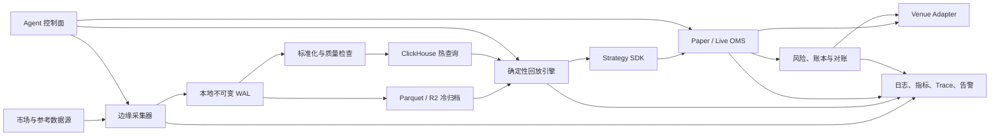

# 目标系统架构

版本：v0.1｜状态：Proposed

## 1. 总体结构



数据面、执行面和控制面分离。网络或 ClickHouse 故障不能阻止原始事件先进入本地
WAL；live adapter 即使存在，也必须由风险门禁和独立配置显式启用。

## 2. 组件职责

| 组件 | 职责 | 关键输出/接口 |
|---|---|---|
| Collector | 连接、订阅、心跳、重连、断序检测、原始落盘 | versioned raw envelope |
| Normalizer | 解析时间/序列/价格数量，映射 instrument，隔离坏数据 | canonical events + quarantine |
| Archive | 压缩、分区、校验和、生命周期、可重放索引 | immutable Parquet objects |
| ClickHouse | 近期事实、质量、延迟和研究查询 | versioned DDL/views |
| Replay | 按确定规则调度事件，注入延迟、费用和故障 | reproducible run artifact |
| Strategy SDK | 事件生命周期、信号、目标仓位、订单意图 | strategy event/output contract |
| OMS | 幂等订单、状态机、超时、重试、未知状态恢复 | order/fill state transitions |
| Risk/Ledger | 前置限额、账本、PnL、余额/持仓/结算对账 | approvals, ledger, exceptions |
| Agent Control | 注册、版本、不可变配置、任务和健康状态 | control API + audit trail |
| Observability | 统一 correlation ID、指标、日志、trace 和告警 | dashboards + alerts |

## 3. 时间与数据语义

每条原始事件至少保留：

- `source_event_ts_ms`：源系统提供的事件时间，可为空；
- `recv_wall_ts_ms`：本机校准后的墙上时间，用于跨系统对照；
- `recv_mono_ns`：单进程单调时钟，用于稳定测量内部间隔；
- sequence/update ID：源提供则原样保留；
- 原始 payload、连接 session、schema version 和采集 commit。

快照的新鲜度、消息到达延迟、内部处理延迟必须是不同指标。没有源时间戳时只报告
接收间隔；时钟误差必须随 benchmark 一起发布。

## 4. 建议的 monorepo 布局

```text
apps/
  console/               # 运维与研究控制台
crates/
  event-contracts/       # canonical schema 与版本兼容
  collector-core/        # 连接、WAL、状态机
  collectors/            # binance/predictfun/polymarket/chainlink/deribit
  replay/                # 确定性事件调度与模拟
  execution/             # OMS、venue adapter、paper/live
  risk-ledger/           # 风控、账本、对账
services/
  control-plane/         # Agent、配置、审计 API
research/                # SQL/Python notebooks 和冻结数据集说明
infra/                   # IaC、镜像、部署与监控
schemas/                 # JSON/Avro/Proto/SQL schema
docs/                    # 需求、架构、ADR、runbook
tools/benchmark/         # 当前 Node 探索工具后续迁入位置
```

在 D-002/D-003 未确认前，不做机械搬迁；现有 `benchmark/` 继续作为可运行的探索基线。

## 5. 初始部署拓扑

- **东京测量节点**：优先验证 Predict.fun、Binance 和所需参考价，运行 collector、
  WAL、质量指标与 paper strategy。
- **第二地域节点**：只有在业务和平台条款允许且 benchmark 证明必要时增加；不同
  region 的原始事件独立落盘，不能把公网复制延迟混为源到达延迟。
- **控制与查询**：早期可与东京节点合并以降低复杂度；生产阶段按故障域拆分。
- **冷归档**：对象存储保存可重放原始数据；ClickHouse 可删除重建，不是唯一真相源。

## 6. 故障边界与安全

- 每个 source/stream 独立连接、队列、熔断和磁盘配额，避免单源拖垮全局。
- WAL 写入失败时停止接收或明确丢弃并告警，禁止静默继续。
- 配置不可变且带版本；密钥只由运行时 secret reference 解析。
- live adapter 默认不编排、不授权；启用需要环境、账户、策略和风险四重白名单。
- 所有订单意图、风控判定、API 回执和人工动作使用统一 correlation ID 审计。

## 7. 尚未冻结的架构点

技术栈、最终 region、ClickHouse 托管方式、冷热保留、确切 SLO 和 live venue 均为
开放决策，见 [`OPEN_DECISIONS.md`](../requirements/OPEN_DECISIONS.md)。这些不妨碍
数据契约、回放接口和 paper OMS 的先行开发。
