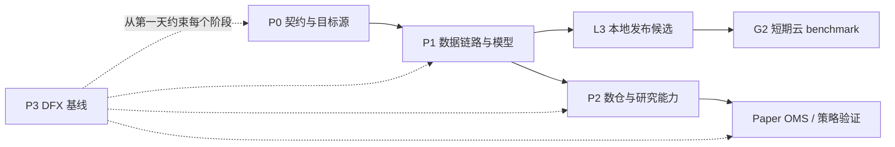

# 实施路线图：数据优先、研究后置、DFX 贯穿

版本：v0.2｜更新时间：2026-08-20｜状态：Approved / Local-first amended

## 1. 总体顺序

第一期不以策略收益或交易 UI 为目标，而是先证明：数据源能持续连接、原始事件不会
静默丢失、统一模型可从实采 payload 推导、历史数据可以重放。



2026-08-20 起，云服务器不再是 P0/P1 开发前置条件。除真实地域网络、长期 soak、云账单、
云时钟和 IaC 实机验证外，契约、WAL、canonical、质量规则、回放、paper OMS、故障注入、
部署预检和上线验证器均优先在本地完成。

### 本地发布候选门禁 L3

- `make verify-local` 成为日常开发验收入口；
- `make verify-release` 必须在 clean commit 上通过；
- 输出版本化阈值下的机器可读 `report.json` 和逐步骤日志；
- 同一验证器的 `host-smoke` 模式作为未来云节点部署后的第一条命令；
- L3 通过后才创建 AWS 账号/短期实例，不提前购买 EBS、R2 或长期承诺。

目标 venue 是 Predict.fun 和 Polymarket；Binance 是第一参考价源。两者先完成公开或
授权只读数据，execution adapter 可以定义接口但默认禁用。Polymarket 未发现官方公开
sandbox/testnet，因此任何真实订单路径保持阻塞。

## 2. P0：数据源与契约固定

### 自动化完成

- 固定 source/stream/market/instrument/outcome 命名；
- 为 Binance、Polymarket、Predict.fun 建立连接、鉴权和消息契约测试；
- 保存最小脱敏 payload fixture 和 schema fingerprint；
- 将源时间、接收 wall clock、monotonic clock、sequence 和 session 写入统一 envelope；
- 为连接、订阅、心跳、退避、重连、断序和限流建立共享状态机。

### 人工介入

- 确定首批合约范围和滚动规则；建议 BTC/ETH 短周期市场 + 少量高活跃事件市场；
- Predict.fun：提交 Discord 工单，取得 Testnet create/cancel 许可和主网只读 key；
- Polymarket：只读无需账户；任何 execution 前从实际出口 IP 检查 geoblock，确认账户、
  地域、主体和使用条款；
- Chainlink/Deribit：若要进入第一期，提供明确 feed ID/channel；默认延后，不阻塞双 venue；
- AWS：后移到本地 L3 发布候选通过后；届时再创建账号/项目、付款方式、预算告警接收人
  和最小权限部署角色。

### 完成标准

- 三个核心源的契约有版本、fixture 和 parser test；
- 公开/授权只读端点均可本地运行 30 分钟；
- 所有写接口在代码、配置和 CI 中默认拒绝；
- 人工选择的市场清单可版本化，不依赖“自动选第一个热门市场”。

## 3. P1：跑通数据链路并获得数据模型

### 数据路径

```text
REST/WS source
  → collector session
  → immutable NDJSON/WAL
  → segment seal + checksum + manifest
  → Parquet/R2 archive
  → normalize + validate + quarantine
  → canonical event samples and candidate DDL
```

### 自动化完成

- collector 独立队列、磁盘配额、backpressure、断线续接和 session 统计；
- WAL 在 ClickHouse/R2 不可用时继续落盘，segment 目标 64–256 MB；
- 原始对象 checksum、source/time range、row count、schema version 和 Git commit；
- NDJSON → Parquet 确定性转换；重复运行结果一致；
- 质量规则：时间戳、重复、断序、负价差、交叉盘口、空盘口、异常价格数量；
- 从实采 payload 形成 canonical schema 和 ClickHouse 候选 DDL；
- 输出 24h/7d 的吞吐、延迟、质量、容量和成本报告。

### 人工介入

- 修复服务器/本机系统时钟和 DNS 的管理员配置；
- 对不能自动映射的跨 venue market/outcome 做一次审核；
- 批准 quarantine 规则和数据保留期；
- 判断某个字段是官方事实、派生值还是未知，不允许模型自行猜测业务语义。

### 完成标准

- 连续 24 小时无静默断流；7 天用于容量和抖动外推；
- 任意 canonical 行可回到原始对象、offset 和 parser 版本；
- 数据库清空后可从 manifest 恢复样本；
- schema drift 会阻断或隔离，不会悄悄改变字段含义。

## 4. P2：数仓与研究能力

### 4.1 数仓是什么

数仓不是“把所有 JSON 丢进一个大数据库”。它把同一份事实组织成三个可追溯层：

| 层 | 通俗解释 | 保存内容 | 是否可重建 |
|---|---|---|---|
| Raw/Bronze | 原始证据 | 原始 payload、连接与时间信息 | 否，必须长期保存 |
| Canonical/Silver | 统一事实 | 标准 trade、book、BBO、market、reference price | 是，从 Raw 重算 |
| Serving/Gold | 面向问题的结果 | 1s/1m bar、spread、波动、跨 venue 差、研究标签 | 是，从 Silver 重算 |

例如研究“Binance BTC 快速上涨后 Predict.fun/Polymarket 概率多久响应”，Raw 保存三方
原始消息；Silver 把时间、标的、价格和盘口统一；Gold 生成 Binance return、两个 venue
的 probability change、lead/lag 和质量掩码。研究员查询 Gold，但结论可以一路回溯到 Raw。

### 4.2 核心表与模型

维表描述“它是谁”：

- `dim_source`、`dim_instrument`、`dim_event`、`dim_market`、`dim_outcome`；
- `bridge_market_mapping` 保存跨 venue 映射、置信度、证据和人工审批。

事实表描述“发生了什么”：

- `fact_trade`、`fact_book_snapshot`、`fact_book_delta`、`fact_bbo`；
- `fact_reference_price`、`fact_market_status`、`fact_resolution`；
- `fact_source_connection`、`fact_latency_sample`、`fact_data_quality`。

研究层保存“如何得到结论”：

- `dataset_manifest`：时间范围、源、市场、schema、代码 commit 和对象清单；
- `feature_value`：特征名、版本、as-of time 和输入版本；
- `experiment_run`：参数、费用、延迟模型、随机种子和结果 artifact；
- `backtest_order/fill/equity`：模拟订单、成交和资金曲线。

### 4.3 研究和回测能力

- 冻结数据集：同一个 manifest 永远指向同一批输入；
- point-in-time join：只允许使用当时已经可见的数据，防止未来数据泄漏；
- 确定性 replay：相同 commit/config/dataset/seed 得到相同结果；
- 执行现实性：费用、滑点、盘口冲击、队列、部分成交、延迟和结算；
- 实验登记：baseline、参数、训练/验证/测试区间、失败结果也保留；
- 报告：PnL 之外必须给容量、换手、回撤、敏感性、置信区间和数据质量覆盖率。

### 4.4 P2 完成标准

- 任意 Gold 指标可展示 lineage：公式 → Silver 行 → Raw object；
- 空 ClickHouse 可由对象存储重建已冻结数据集；
- 黄金回放夹具在 CI 中结果稳定；
- 调整费用、延迟、滑点后策略结论仍可解释；
- 不允许 notebook 中手工修改数据后直接作为正式结论。

## 5. P3：完整 DFX 能力强化

DFX 是 `Design for X`：从设计阶段保证系统不仅“能跑”，还容易开发、测试、运维、
恢复和审计。P3 不是等 P2 完成后才补，而是从 P0 建立最低基线，P3 完成全面强化。

| X | 必备能力 | 验收证据 |
|---|---|---|
| Developer Experience | 一键 bootstrap、统一任务入口、生成 schema/client、本地 mock、示例配置 | 新环境 30 分钟内跑通只读采集 |
| Testability | unit/contract/integration/property/fuzz、黄金 fixture、虚拟时钟、故障注入 | CI 可复现断网、乱序、磁盘满、429/5xx |
| Reliability | WAL、backpressure、限流、退避、熔断、幂等、未知状态恢复 | 24h/7d soak，无静默丢失 |
| Observability | metrics/log/trace、correlation ID、数据 freshness、成本和 SLO dashboard | 不登录机器即可定位停在哪一段 |
| Operability | IaC、不可变配置、预检、部署、回滚、runbook、值班告警 | 自动部署/回滚演练通过 |
| Recoverability | RPO/RTO、对象 manifest、快照、空库恢复、灾难演练 | 定期恢复报告和校验和一致 |
| Security | 最小权限、secret manager、secret scan、SAST、依赖审计、SBOM、镜像签名 | 主分支无高危与凭据泄漏 |
| Performance | micro/soak/latency benchmark、profile、批量与队列水位、回归门禁 | P99/吞吐退化超过阈值阻断合并 |
| Data Quality | schema drift、完整性、断序、跨源校验、quarantine、质量评分 | 质量低于门槛的数据不进研究集 |
| Reproducibility | code/config/schema/data/seed 全版本化，容器与 lockfile | 一条命令复现正式实验 |
| Maintainability | 模块边界、ADR、lint、API compatibility、迁移测试、ownership | 破坏性 schema 变更必须显式迁移 |
| Cost Efficiency | 资源标签、预算告警、每源/每 TB 成本、保留期、自动降配建议 | 月账单偏差 >25% 有归因 |
| Compliance/Audit | 数据来源、条款快照、人工审批、订单/配置审计、地域检查 | 任意敏感动作可回答谁/何时/为何 |

### P3 工程基线

- Rust：`cargo fmt/clippy/test/audit/deny`，property/fuzz 和 criterion benchmark；
- TypeScript：format/lint/typecheck/unit/integration、OpenAPI/schema 生成和 browser smoke；
- Python/SQL：lockfile、lint/typecheck/test、SQL lint、notebook 参数化和无状态执行；
- 全仓：pre-commit、GitHub Actions、secret scan、Dependabot/Renovate、SBOM、license policy；
- 发布：语义版本、changelog、artifact provenance、容器扫描/签名、环境 promotion；
- 运维：Terraform plan 审批、成本预估、canary deploy、rollback、恢复与故障演练。

## 6. 当前可以自动推进与必须人工介入

| 工作 | 自动推进 | 人工介入点 |
|---|---:|---|
| Polymarket Gamma/Data/CLOB read + Market WS | 是 | 固定市场清单 |
| Predict.fun Testnet/read-only client | 是 | 官方工单回复与 key |
| Binance 参考源 | 是 | 选择标的，默认 BTCUSDT/ETHUSDT |
| WAL/Parquet/R2/manifest/质量检查 | 是 | 云账号、保留期审批 |
| 数据模型、候选 DDL、回放和研究框架 | 是 | 跨 venue 映射歧义审核 |
| CI、测试、观测、IaC 和恢复工具 | 是 | 云部署角色、告警接收人 |
| Polymarket/Predict 主网写接口 | 否 | 资格、条款、钱包、限额、风险审批 |
| 真实资金、token approval、live canary | 否 | G3 独立书面批准 |

除这些外部账户、资金、地域和业务语义决策外，上线前的大部分数据接口和工程底座可以
在本地、公开只读接口和受控测试环境中完成。
