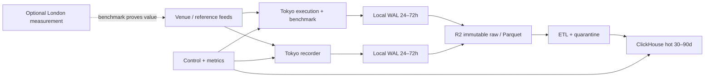

# 基础设施容量与成本需求

版本：v0.1｜估算日期：2026-08-18｜币种：USD，预算汇率 `1 USD = ¥7.2`

## 1. 结论与采购边界

现有证据足以完成数据面、回放、paper OMS、Agent 和单机 ClickHouse 的主体设计，
但不足以一次性采购“生产终态”。推荐按证据分三次投入：

1. 先批准 14 天 benchmark，预算上限 **$150 / ¥1,080**；
2. 数据契约和 24h 连续运行通过后，批准 3 个月研究环境，预算上限
   **$2,600 / ¥18,700**；
3. 只有在 30 天容量曲线稳定后，再选择 12 个月目标子集方案，按需价预算
   **$18,900 / ¥136,000**，预计稳定底座承诺购买后约
   **$15,700 / ¥113,000**。

这些金额是基础设施预算，不包含交易本金、平台付费数据、账户资格、法律意见和
团队工资。所有长期资源必须能由 benchmark 的吞吐、保留期或 SLO 解释。

## 2. 证据如何改变设计

### 2.1 已观察容量

- `CONFIRMED`：SignalX 可观察的 ClickHouse 有 43 张表、约 150.14 亿行、
  394 GB 压缩数据；宿主文件系统已用约 2.5 TB、容量约 14.4 TB。
- `CONFIRMED`：当前 5 个在线 Agent 合计显示约 3,026 events/s。
- `INFERRED`：若这一速率有代表性，150 亿行约对应 57 天；逻辑压缩数据增长约
  6.6–9.9 GB/day，规划按 **10–15 GB/day**。
- `INFERRED`：2.5 TB 文件系统占用与 394 GB 表压缩量的差异可能来自原始 segment、
  合并临时文件、detached part、缓存或非 ClickHouse 数据，不能直接当作我们的表容量。
- `CONFIRMED`：原系统对象存储对象数约千万级；按行数外推，对象可能过小，必须避免
  沿用“小对象爆炸”的实现。

### 2.2 落地后的容量要求

| 层 | 初始保留 | 扩容触发 | 设计要求 |
|---|---:|---|---|
| Agent WAL | 24–72 小时 | 峰值写入后剩余空间低于 30% | 每源独立配额；数据库不可用仍可写；校验和 |
| ClickHouse hot | 30–90 天 | P95 查询、merge backlog 或磁盘水位越界 | 单机可重建；先 1–2 TB，按周扩到 4 TB |
| 对象存储 raw/Parquet | 至少 12 个月 | 生命周期/合规决定 | 原始不可变；64–256 MB 目标对象；manifest 可重放 |
| 快照 | 7 日滚动 + 月度恢复点 | 恢复演练失败 | 只备元数据和不可从对象存储重建的状态 |
| quarantine | 30 天 hot、12 个月 cold | 超过总事件 1% 立即调查 | 不允许无上限吞噬热盘 |

按 10–15 GB/day 计算，一年新增压缩/归档数据约 **3.65–5.48 TB**。对象存储月末
容量费约 $55–82，全年平均容量约 1.83–2.74 TB；因此没有理由第一天购买 14.4 TB
热盘。东京 gp3 若按 $0.096/GB-month 规划，14.4 TB 热盘单月约 $1,382，明显高于
分层存储方案。

## 3. 目标部署结构

- benchmark 阶段允许采集、ClickHouse 和控制面合并，降低固定成本；
- 长期将执行和 recorder 分开，避免 merge、压缩和回补形成尾延迟抖动；
- 第二地域只用于合法数据源的对照或确有收益的执行路径，不能替代账户资格判断；
- ClickHouse 不是事实唯一来源，故障后从对象存储 manifest 重建；
- live execution 仍受 G3 门禁约束，租服务器不等于取得实盘授权。

## 4. 网络需求与升级条件

公网下单是低带宽、小包、尾延迟敏感的工作负载。`c7i.xlarge` 已提供最高
12.5 Gbit/s；把它换成最高 40 Gbit/s 的 `c7gn.xlarge`，东京按需价每月约增加
$65.77，但不会自动改善公网路由或 venue 处理时间。

必须先记录以下分段指标，再决定网络升级：

- DNS、TCP、TLS、连接池获取、首字节、完整 HTTP response、order ack；
- ack 到 user stream update、首个 fill、最终 fill；
- P50/P95/P99/P99.9、超时率、重连、时钟误差与样本量；
- 东京与伦敦相同时窗、相同请求类型的 paired comparison。

满足任一条件才试用 `c7gn` 或第二地域：

- 网络队列/带宽持续超过实例基线 60%；
- 相同 AZ、相同应用版本下，A/B 测试 P99 至少改善 10%，且连续三个窗口复现；
- venue 实测路由证明另一地域改善 order ack 或 fill，而不只是 ICMP ping；
- 收益覆盖新增月费、部署复杂度和数据一致性成本。

执行节点不默认使用 NAT Gateway，避免额外固定费、流量费和网络跳数；采用最小安全组、
受控公网出口、SSM/等价管理通道。禁止把完整市场事件写入 CloudWatch 日志，指标聚合与
采样日志进入控制节点，原始事件只进 WAL/对象存储。

## 5. 计价基线

所有月价按 730 小时估算。EC2 为 2026-08-17 发布的 AWS 官方东京/伦敦 Linux
On-Demand 价目；其余数字是用于预算的公开单价或保守假设，采购日必须在云计算器复核。

| 资源 | 地域 | 规划单价 | 用途 |
|---|---|---:|---|
| EC2 `c7i.large` | 东京 | $0.11235/hour | 小规格测量 |
| EC2 `c7i.xlarge` | 东京 | $0.22470/hour | 采集/执行，4 vCPU/8 GiB |
| EC2 `c7i.2xlarge` | 东京 | $0.44940/hour | 原系统吞吐模拟，8 vCPU/16 GiB |
| EC2 `r7i.xlarge` | 东京 | $0.31920/hour | M1 ClickHouse，4 vCPU/32 GiB |
| EC2 `r7i.2xlarge` | 东京 | $0.63840/hour | 长期 ClickHouse，8 vCPU/64 GiB |
| EC2 `t4g.small` | 东京 | $0.02160/hour | 控制与轻量指标 |
| EC2 `c7i.xlarge` | 伦敦 | $0.21210/hour | 可选对照节点 |
| EBS gp3 | 东京预算值 | $0.096/GB-month | WAL/热数据；默认 3,000 IOPS/125 MB/s |
| EBS snapshot | 预算值 | $0.05/GB-month | 增量快照预算 |
| Cloudflare R2 Standard | 全球 | $0.015/GB-month | 长期 raw/Parquet，出口免费 |
| AWS 公网 IPv4 | 全球 | $0.005/IP-hour | 只给需要固定入口/出口的节点 |
| AWS Secrets Manager | AWS | $0.40/secret-month | API 凭据，不含少量调用费 |
| AWS 公网流出 | 东京预算值 | $0.114/GB | 每月全局 100 GB 免费额度后估算 |

R2 Standard 另有 Class A $4.50/million、Class B $0.36/million。若每个对象只有约
1,380 行，千万级 PUT 会产生不必要的操作和索引成本；本项目以 64–256 MB 或固定时间窗
seal segment，目标每源每天数百对象以内。

## 6. 租赁明细

### 6.1 S0：14 天 benchmark（立即建议）

为排除实例规格影响，前 7 天使用 `c7i.large`，后 7 天使用 `c7i.xlarge`，订阅范围和
时窗保持一致；伦敦节点是可选增量。

| 项目 | 数量/周期 | 小计 |
|---|---:|---:|
| 东京 `c7i.large` | 168 h | $18.87 |
| 东京 `c7i.xlarge` | 168 h | $37.75 |
| gp3 200 GB | 14/30 month | $8.96 |
| 公网 IPv4 | 336 h | $1.68 |
| R2 平均容量/请求 | 预算 | $1.00 |
| AWS→R2 流出 | 140 GB 中超免费额度 40 GB | $4.56 |
| 5 个 secret | 14/30 month | $0.93 |
| DNS、指标、告警 | 封顶预算 | $10.00 |
| **基础小计** |  | **$83.76** |
| **含 30% 预备金** |  | **$108.89 / ¥784** |

建议实际设云预算告警为 **$100、硬上限审批 $150**。可选伦敦 7 天对照约增加
$30–40。benchmark 完成后实例和 EBS 可删除，R2 样本继续保留。

### 6.2 M1：3 个月研究/paper 环境

| 项目 | 月配置 | 月小计 |
|---|---:|---:|
| 东京采集/paper `c7i.xlarge` | 1 | $164.03 |
| 东京 ClickHouse `r7i.xlarge` | 1 | $233.02 |
| 控制/指标 `t4g.small` | 1 | $15.77 |
| gp3：300 GB WAL + 2 TB hot + 50 GB control | 2.35 TB | $225.60 |
| 快照 | 500 GB 增量预算 | $25.00 |
| R2 容量 + 操作 | 封顶预算 | $20.00 |
| AWS→R2 流出 | 300 GB/month，扣 100 GB 免费额 | $22.80 |
| IPv4、10 secrets、DNS |  | $11.80 |
| 指标、日志、告警 | 封顶预算 | $25.00 |
| **月基础小计** |  | **$743.01** |
| **3 个月含 15% 预备金** |  | **$2,563 / ¥18,456** |

采购上限取整为 **$2,600 / ¥18,700**。此阶段不购买 1 年承诺，不部署 live，不复制
14.4 TB 热盘。

### 6.3 L1：12 个月目标子集稳定运行（推荐长期上限）

| 项目 | 月配置 | 月小计 |
|---|---:|---:|
| 东京执行/benchmark `c7i.xlarge` | 1 | $164.03 |
| 东京 recorder `c7i.xlarge` | 1 | $164.03 |
| ClickHouse `r7i.2xlarge` | 1 | $466.03 |
| 控制/指标 `t4g.small` | 1 | $15.77 |
| gp3：100 GB + 500 GB + 4 TB + 50 GB | 4.65 TB | $446.40 |
| 快照 | 1 TB 增量预算 | $50.00 |
| R2 年均容量 + 操作 | 10 GB/day 场景 | $32.38 |
| AWS→R2 流出 | 300 GB/month，扣免费额 | $22.80 |
| IPv4、15 secrets、DNS |  | $17.95 |
| 指标、日志、告警 | 封顶预算 | $50.00 |
| **月基础小计** |  | **$1,429.39** |
| **按需价 + 10% 预备金** |  | **$1,572/month** |
| **按需价 12 个月** |  | **$18,868 / ¥135,849** |

运行 30 天后，仅对稳定 compute 底座用 1 年 Savings Plan。预算模型暂按 compute
节省 30% 而不是使用厂商“最高 72%”宣传值，则约 **$1,305/month，
$15,661/year / ¥112,758**；实际承诺额必须采用 Cost Explorer 推荐值。

### 6.4 L2：接近原系统规模、东京 + 伦敦（非当前建议）

此方案包含东京执行与 recorder、两个伦敦节点、64 GiB ClickHouse、8 TB hot、
2 TB snapshot 和更高观测预算，基础小计约 **$2,656/month**；含 15% 预备金为
**$3,054/month，$36,649/year / ¥263,876**。按 compute 规划节省 30% 后仍约
**$31,007/year / ¥223,253**。

它只能由以下证据触发：目标子集确实接近 3,000 events/s、跨地域 benchmark 改善
order ack/fill、4 TB hot 不满足已批准保留期，或已签署的可用性 SLO 要求故障域分离。
真正的 ClickHouse 高可用副本会额外增加约 $1,300/month，不在 L2 内。

## 7. 其他资金和人员投入

| 类别 | 估算 | 是否含在云预算 | 说明 |
|---|---:|---:|---|
| IaC、安全、告警、恢复演练 | 8–15 engineer-days | 否 | G2 必需 |
| 数据契约、采集器、benchmark | 15–25 engineer-days | 否 | M1 必需 |
| replay、paper OMS、质量规则 | 25–45 engineer-days | 否 | M2–M3 |
| 合计工程投入 | 48–85 engineer-days | 否 | 按 ¥2,000–4,000/day 为 ¥96k–340k |
| 外部数据/API | $0–500/month 暂存 | 否 | 等正式报价/账户条款，不可自动消费 |
| 法律、合规、账户资格 | 待报价 | 否 | 阻塞 live，不阻塞只读研究 |
| 交易本金与亏损准备 | 未纳入 | 否 | 必须由风险负责人在 G3 单独批准 |

因此，一年的“项目现金需求”不能只报服务器：推荐 L1 云资源约 ¥113k–136k，
加工程人力约 ¥96k–340k，已知合计约 **¥209k–476k**；再另加数据服务和合规报价。
该区间不是实盘盈利或本金建议。

## 8. 采购与扩容门禁

- S0 前：云账号 owner、预算告警、数据源清单、采样范围和销毁规则明确；
- S0 结束：形成 24h/7d 报告，给出事件率、GB/day、CPU、内存、磁盘、网络和
  端到端 order benchmark；
- M1 前：决定 D-006 保留期、D-012 对象存储、D-013 网络升级条件；
- L1 前：至少 30 天容量曲线，预测误差低于 25%，恢复演练通过；
- 承诺购买前：只覆盖可预测的 60–70% compute，不承诺实验节点和第二地域；
- L2 前：业务负责人书面确认跨地域收益、平台资格和年度成本上限。

任何连续 7 天利用率低于 20% 的非控制节点都应降配或按时启停；磁盘扩容采用每周
forecast，不因观察到原系统 14.4 TB 容量就机械复制。

## 9. 价格来源与复核

- [AWS Bulk Price List API](https://docs.aws.amazon.com/awsaccountbilling/latest/aboutv2/using-the-aws-price-list-bulk-api-fetching-price-list-files-manually.html)：
  本文 EC2 区域价由官方区域价目查询；[EC2 On-Demand](https://docs.aws.amazon.com/AWSEC2/latest/UserGuide/ec2-on-demand-instances.html)
  按秒计费、最低 60 秒，无长期承诺。
- [Amazon EBS pricing](https://aws.amazon.com/ebs/pricing/)：gp3 基线含 3,000 IOPS
  和 125 MB/s；超出部分单独计费，本预算未购买额外性能。
- [Cloudflare R2 pricing](https://developers.cloudflare.com/r2/pricing/)：Standard 公开价为
  $0.015/GB-month，互联网 egress 免费，但 EC2 上传到 R2 仍可能产生 AWS 公网流出费。
- [Amazon VPC pricing](https://aws.amazon.com/vpc/pricing/)：公网 IPv4 为
  $0.005/IP-hour；[Secrets Manager pricing](https://aws.amazon.com/secrets-manager/pricing/)
  为 $0.40/secret-month，调用费另计。
- [AWS Savings Plans](https://docs.aws.amazon.com/savingsplans/latest/userguide/what-is-savings-plans.html)
  是 1 或 3 年使用额承诺；本模型的 30% 只是规划折扣，不是报价。

采购日应保存 AWS Calculator 导出和 R2 价格页快照，记录税费、付款币种、汇率与
免费额度是否已被同一账号其他工作负载占用。
