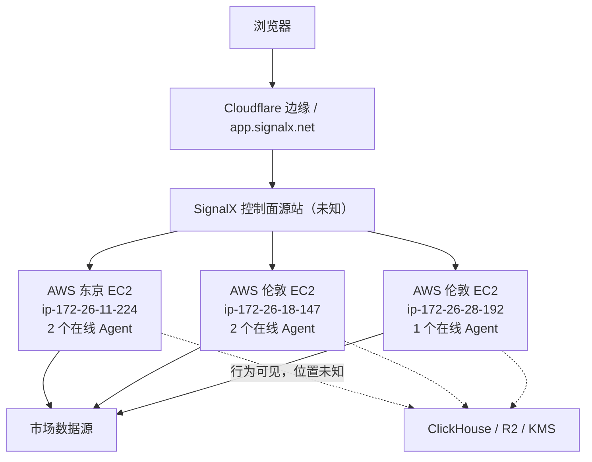

# 原项目推断部署拓扑

版本：v0.1｜观察日期：2026-08-18
用途：记录从公开网络信息和授权控制台可观察行为得到的清洁室推断。

> 本文描述的是证据边界，不是原项目完整资产清单，也不是目标系统必须照搬的架构。

## 1. 当前结论

SignalX Web 入口由 Cloudflare 代理；当次访问命中的 `SIN` 是 Cloudflare 边缘节点，
不能据此判断应用源站位于新加坡。授权控制台中在线 Agent 的主机名和公网 IPv6
前缀表明，其计算节点至少分布在 AWS 东京 `ap-northeast-1` 和伦敦 `eu-west-2`。

按当次在线主机名去重，可证明的下限是 **3 台 AWS EC2 主机**：东京 1 台、伦敦
2 台。实例类型、账户、VPC、完整公网地址、控制面源站和数据库位置无法由现有证据
确定。

## 2. 证据表

| 观察 | 推断 | 置信度 | 边界 |
|---|---|---:|---|
| `app.signalx.net` 返回 Cloudflare 地址和响应头 | Web 入口使用 Cloudflare 代理/CDN | 高 | 不暴露源站云厂商和地域 |
| `jp-record`、`jp-winner-tail-sweep` 共用 `ip-172-26-11-224` | 两个 Agent 位于同一私网主机 | 高 | 不知道容器/进程隔离方式 |
| 该主机 IPv6 属于 AWS `2406:da14::/35` | 主机在 EC2 `ap-northeast-1` | 高 | 不能反推出 AZ、实例类型 |
| `lon-aggr-pmhft`、`lon-trade-twap` 共用 `ip-172-26-18-147` | 两个伦敦 Agent 位于同一主机 | 高 | 同上 |
| `lon-crypto-updown-record` 使用 `ip-172-26-28-192` | 另有一台伦敦主机 | 高 | 同上 |
| 两台伦敦主机 IPv6 属于 AWS `2a05:d01c::/35` | 主机在 EC2 `eu-west-2` | 高 | 不能反推出内部拓扑 |
| 控制台观察到 ClickHouse、R2、KMS 等行为 | 系统存在数仓、归档、密钥能力 | 中 | 具体厂商形态与位置未知 |

地域判断使用 AWS 官方公开的 `ip-ranges.json` 对当次 IPv6 前缀映射；内部
`172.26.x.x` 主机名本身只能说明 VPC 私网地址，不能单独证明地域。

## 3. 可观察拓扑

控制台当时还显示 12 个离线 Agent；它们可能对应更多主机、历史主机或同机进程，
无法据此增加服务器数量结论。

## 4. 能确定与不能确定的内容

可以确定：

- 前端入口在 Cloudflare 之后；
- 当前在线计算使用 AWS EC2；
- 东京和伦敦均有部署；
- 在线主机至少三台，多个 Agent 可共用主机。

不能确定：

- Cloudflare 后的应用源站 IP、云厂商和 region；
- EC2 实例系列、AZ、操作系统、容器编排和购买方式；
- ClickHouse 是自建还是托管、R2 bucket 位置和 KMS 归属；
- 完整 VPC、安全组、负载均衡、数据库 schema 和离线节点资产；
- 节点命名是否精确代表业务职责。

## 5. 对目标项目的启示

东京/伦敦双地域说明“计算靠近数据源或交易场所”很可能是重要设计因素，但不能把
原项目地域直接当作我们的答案。目标架构应先在东京跑可复现 benchmark，再根据
目标 venue、合规边界、尾延迟、完整性和成本决定是否增加伦敦节点。

相关目标设计已收敛到[白皮书](../../docs/WHITEPAPER.md)的软件架构章节。
